<div align="center">

<h1>Informe del Trabajo Final</h1>
<h2>Universidad Peruana de Ciencias Aplicadas</h2>

<h4>Ingenieria de Software</h4>
<h4>Aplicaciones Web</h4>
<h4>1ASI0730-2520-7469</h4>
<h4>Docente: Angel Augusto Velasquez Nuñez</h4>
<h4>Startup: WineSoft</h4>
<h4>Producto: WineSoft</h4>

## Team memebers:
|              Nombre              |   Código   |
|:--------------------------------:|:----------:|
| Angelo Stephano Moscoso Bejar    | U20211G499 |
| Yazid Said Conde                 | U202312348 |
| Joan Fernando Teves Samaniego    | U202117303 |
| Antonio Rodrigo Duran Díaz       | U202215721 |
| Gonzalo Alonso Carhuancote Dominguez  | U202210720 |
<h4>Ciclo 2025-02</h4>
</div>

<div>
  
## Registro de Versiones del Informe

| Versión | Fecha       | Autor                                                                                                   | Descripción de modificación |
|---------|------------|---------------------------------------------------------------------------------------------------------|-----------------------------|
| **TB1** | 15/09/2025 | Angelo Stephano Moscoso Bejar <br><br> Yazid Said Conde <br><br> Joan Fernando Teves Samaniego<br><br>Antonio Rodrigo Duran Díaz<br><br>Gonzalo Alonso Carhuancote Dominguez | Para esta primera entrega, realizamos los primeros 5 capítulos del informe y desarrollamos la primera versión del landing page del Producto. |

</div>

## Project Report Collaboration Insights

<div>
<p>Para este informe se dividio de la siguiente forma para cada integrante del grupo:</p>
  
  ## 
  
  |  Integrantes   | Tarea asignada |
  |:--------------:|:--------------:|
  | Yazid Said Conde | U202312348   |
## Contenido 
## Tabla de Contenidos

</div>
------------
(INDICE INCOMPLETO)
- [Registro de Versiones del Informe](#registro-de-versiones-del-informe)
------------


# Contenido

## [Student Outcome](#ingeniería-de-software)
## [Capítulo I: Introducción]()
* ### [1.1. Startup Profile]()
    * #### [1.1.1. Descripción de la Startup]()
    * #### [1.1.2. Perfiles de integrantes del equipo]()
* ### [1.2. Solution Profile]()
    * #### [1.2.1. Antecendentes y Problemática]()
    * #### [1.2.2. Lean UX Process]()
        * ##### [1.2.2.1. Lean UX Problem Statements]()
        * ##### [1.2.2.2. Lean UX Assumptions]()
        * ##### [1.2.2.3. Lean UX Hypothesis Statements]()
        * ##### [1.2.2.4. Lean UX Canvas]()
* ### [1.3. Segmentos objetivo]()

## [Capítulo II: Requirements Elicitation & Analysis]()
* ### [2.1. Competidores]()
    * #### [2.1.1. Análisis competitivo]()
    * #### [2.1.2. Estrategias y tácticas frente a competidores]()
* ### [2.2. Entrevistas]()
    * #### [2.2.1. Diseño de entrevistas]()
    * #### [2.2.2. Registro de entrevistas]()
    * #### [2.2.3. Análisis de entrevistas]()
* ### [2.3. Needfinding]()
    * #### [2.3.1. User Personas]()
    * #### [2.3.2. User Task Matrix]()
    * #### [2.3.3. User Journey Mapping]()
    * #### [2.3.4. Empathy Mapping]()
    * ### [2.4. Big Picture Event Storming Language]()
* ### [2.5. Ubiquitous Language]()

## [Capítulo III: Requirements Specification]()
* ### [3.1. User Stories]()
* ### [3.2. Impact Mapping]()
* ### [3.3. Product Backlog]()

## [Capítulo IV: Product Design]()
* ### [4.1. Style Guidelines]()
    * #### [4.1.1. General Style Guidelines]()
    * #### [4.1.2. Web Style Guidelines]()
* ### [4.2. Information Architecture]()
    * #### [4.2.1. Organization System]()
    * #### [4.2.2. Labeling System]()
    * #### [4.2.3. SEO Tags and Meta Tags]()
    * #### [4.2.4. Searching System]()
    * #### [4.2.5. Navigation System]()
* ### [4.3. Landing Page UI Design]()
    * #### [4.3.1. Landing Page Wireframe]()
    * #### [4.3.2. Landing Page Mock-up]()
* ### [4.4. Web Applications UX/UI Design]()
    * #### [4.4.1. Web Applications Wireframe]()
    * #### [4.4.2. Web Applications Wireflow Diagrams]()
    * #### [4.4.3. Web Applications Mock-ups]()
    * #### [4.4.4. Web Applications User Flow Diagrams]()
* ### [4.5. Web Applications Prototyping]()
* ### [4.6. Domain-Driven Software Architecture]()
    * #### [4.6.1. Software Architecture Context Diagram]()
    * #### [4.6.2. Software Architecture Container Diagram]()
    * #### [4.6.3. Software Architecture Components Diagram]()
* ### [4.7. Software Object-Oriented Design]()
    * #### [4.7.1. Class Diagrams]()
    * #### [4.7.2. Class Dictionary]()
* ### [4.8. Database Design]()
    * #### [4.8.1. Database Diagram]()

## [Capítulo V: Product Implementation, Validation & Deployment]()
* ### [5.1. Software Configuration Management]()
    * #### [5.1.1. Software Development Environment Configuration]()
    * #### [5.1.2. Source Code Management]()
    * #### [5.1.3. Source Code Style Guide & Conventions]()
    * #### [5.1.4. Software Deployment Configuration]()
* ### [5.2. Landing Page, Services & Applications Implementation]()
    * #### [5.2.1. Sprint 1]()
        * ##### [5.2.1.1. Sprint Planning 1]()
        * ##### [5.2.1.2. Aspect Leaders and Collaborators]()
        * ##### [5.2.1.3. Sprint Backlog 1]()
        * ##### [5.2.1.4. Development Evidence for Sprint Review]()
        * ##### [5.2.1.5. Execution Evidence for Sprint Review]()
        * ##### [5.2.1.6. Services Documentation Evidence for Sprint Review]()
        * ##### [5.2.1.7. Software Deployment Evidence for Sprint Review]()
        * ##### [5.2.1.8. Team Collaboration Insights during Sprint]()

## [Conclusiones]()
## [Bibliografía]()
## [Anexos]()

## Student Outcome
El curso contribuye al cumplimiento del Student Outcome ABET: ABET – EAC - Student Outcome 5

Criterio: La capacidad de funcionar efectivamente en un equipo cuyos miembros juntos proporcionan liderazgo, crean un entorno de colaboración e inclusivo, establecen objetivos, planifican tareas y cumplen objetivos.

En el siguiente cuadro se describe las acciones realizadas y enunciados de conclusiones por parte del grupo, que permiten sustentar el haber alcanzado el logro del ABET – EAC - Student Outcome 5.

# Capítulo I: Introducción

## 1.1. Startup Profile

### 1.1.1. Descripción de la Startup
<div style="text-align: justify">

**Capa6** es una startup tecnológica que desarrolla soluciones digitales para el sector de bebidas alcohólicas, a través de su plataforma web **WineSoft**. Esta herramienta conecta de forma ágil y ordenada a dueños de destilerías y licorerías con sus proveedores de insumos, digitalizando procesos que suelen ser manuales y poco estructurados.

La aplicación permite a los dueños gestionar un almacén virtual, donde registran y controlan insumos clave para la producción de sus licores. Por su parte, los proveedores cuentan con un sistema propio para manejar su inventario y transporte, lo que les permite identificar las necesidades de sus clientes, organizar entregas y mantener una trazabilidad clara de cada envío.

Con foco en la eficiencia operativa, la reducción de pérdidas y la colaboración digital, **WineSoft** se presenta como una solución moderna, accesible y sostenible que impulsa la transformación digital en un sector con gran potencial de crecimiento en Latinoamérica.

**Mision:**

Impulsar la digitalización de destilerías y licorerías mediante soluciones tecnológicas accesibles que optimicen la gestión de insumos, fortalezcan la relación con proveedores y faciliten procesos más eficientes, ordenados y sostenibles

**Visión:**

Ser la plataforma líder en gestión digital de insumos para el sector de bebidas alcohólicas en Latinoamérica, promoviendo la eficiencia, la transparencia y la colaboración entre productores y proveedores, con una experiencia de usuario moderna, confiable y escalable.

</div>

### 1.1.2. Perfiles de integrantes del equipo
|    Integrante   | Descripcion de Carrera | Conocimientos y Habilidades a apuntar|
| --------------------------------| ----------------------| ------------------------------------ |
| <br> Said Conde, Yazid   | Ingenieria de Software <br>Universiad Peruana de Ciencias Aplicadas | - Conocimientos en lenguajes de Programación como C++, Java, HTML, CSS, JavaScriptm, Python y C#.<br>Me considero que soy una persona muy trabajadora, responsable, puntual y respetuoso. |
| <br> Angelo Stephano Moscoso Bejar   | Ingeniería de Software<br> 5to Ciclo<br>2024-1<br>Universidad Peruana de Ciencias Aplicadas | - Tengo 21 años estoy estudiando actualmente en la Univeridad Peruana de Ciencias Aplicadas. Me ha interasado mucho la creación de paginas web para diversos objetivos. Manejo algunos lenguajes de programación como javascript, C++, C+, Python, entre otros. Considero que tengo las habilidades de comunicación efectiva, organización, proactividad, resolución de problemas, entre otras. Espero aportar de manera satisfactoria en mi grupo para terminar de manera exitosa el proyecto. |
| <br> Gonzalo Alonso Carhuancote Dominguez               | Ingenieria de Software <br>Universiad Peruana de Ciencias Aplicadas | - Tengo 20 años, estudio la carrera de ingeniería de software en la UPC. En mis tiempos libres estudio, juego videojuegos y me informo del mundo actual y moderno. Me apasiona la tecnología y manejo lenguajes como C++, Java, Typescript y Python. |
| <br> Joan Fernando Teves Samaniego | Ingenieria de Software <br>Universiad Peruana de Ciencias Aplicadas | - Tengo 22 años estoy estudiando actualmente en la Univeridad Peruana de Ciencias Aplicadas. Tengo interes por el mundo de la cibersegurirdad y el primer paso es enteder al derecho y al revez las aplicaciones web , se c++ , javascript , html , css , mongodb ,sql , sqlserver , posgresql,python, soy creativo , responsable , trabajo en equipo , me gusta resolver problemas   me adaptofacilmente y gestiono muy bien mi tiempo.Espero que en este proyecto pueda incrementar mis habilidades y conocimiento sobre las aplicaciones web y demas . |
| <br> Antonio Rodrigo Duran Díaz      | Ingeniería de Software<br>Universidad Peruana de Ciencias Aplicadas | - Soy estudiante de la carrera de Ingeniería de Software en la Universidad Peruana de Ciencias Aplicadas y tengo 20 años. Estoy avanzando en mi formación académica y reforzando mis conocimientos en los diferentes temas relacionados con la creación de software. Durante mis estudios me ha gustado trabajar con gestores de bases de datos, en especial con SQL Server y MongoDB. En este proyecto espero seguir mejorando mis habilidades y conocimientos, además de lograr un buen desempeño en el trabajo grupal. |

## 1.2. Solution Profile

### 1.2.1. Antecedentes y problemática

### Antecedentes
<div style="text-align: justify">

En el sector de la producción y distribución de bebidas alcohólicas, especialmente en destilerías y licorerías, una mala gestión de insumos puede traer consecuencias económicas y operativas importantes. La falta de control en el inventario de materias primas como azúcar, alcohol base, levaduras o esencias puede generar sobrecostos, pérdidas por caducidad, deterioro por condiciones de almacenamiento inadecuadas o interrupciones en la producción. Según la Food and Agriculture Organization (FAO, 2021), hasta el 14% de las pérdidas en cadenas de suministro de alimentos y bebidas provienen justamente de fallas en la gestión de inventarios y almacenamiento inadecuado, lo que confirma la magnitud del problema en este sector.

Un caso frecuente en pequeñas y medianas licorerías ocurre cuando los insumos perecederos, como frutas o aditivos, no son monitoreados correctamente ni en cantidad ni en condiciones ambientales. Esto provoca que se echen a perder antes de ser utilizados, afectando tanto la calidad del producto final como la continuidad de la producción. La situación se agrava porque la mayoría de negocios todavía gestionan insumos mediante métodos manuales como hojas de Excel o registros físicos, sin alertas ni integración de sensores. De acuerdo con Gartner (2022), más del 60% de las PYMEs en Latinoamérica siguen utilizando hojas de cálculo para manejar inventarios, lo que incrementa la probabilidad de errores, genera ineficiencias logísticas y retrasa la toma de decisiones.

Además, la informalidad en los procesos logísticos dificulta la coordinación entre proveedores y dueños de licorerías. Los proveedores muchas veces no cuentan con información en tiempo real sobre las necesidades de sus clientes, ni con herramientas para gestionar su propio almacén de forma integrada, lo que retrasa entregas críticas y genera quiebres de stock. Esto abre un espacio para plataformas digitales más accesibles que integren funciones de control de inventario, monitoreo de almacenamiento y gestión logística compartida entre proveedores y dueños.

</div>

### Problemática

<div align="justify">
Para entender la necesidad del proyecto, se aplicó la técnica de las 5W's + 2H's:

### 5W's
### What (¿Cuál es el problema?):

Los dueños de licorerías y destilerías presentan dificultades en la gestión de sus almacenes de insumos, lo que puede ocasionar desperdicio por caducidad, deterioro por condiciones de almacenamiento inadecuadas, sobrecostos por compras urgentes o interrupciones en la producción.

Por otro lado, los proveedores enfrentan problemas para anticipar la demanda de sus clientes, ya que no tienen visibilidad de sus inventarios ni de las condiciones de almacenamiento en tiempo real, además de carecer de herramientas para administrar de manera eficiente su propio stock, lo cual genera retrasos en la entrega y desorganización logística.

### When (¿Cuándo ocurre el problema?):
Cuando los dueños necesitan producir, a veces descubren que insumos clave como frutas, aditivos o alcohol base están por acabarse, ya vencieron o se deterioraron por falta de control en las condiciones de almacenamiento. Esto les genera retrasos y pérdidas si no tienen un control claro.

En el caso de los proveedores, el problema surge cuando intentan reabastecer los almacenes sin tener información clara sobre el inventario y estado de conservación de sus clientes, además de tener que operar su propio almacén con registros desactualizados. Esto provoca retrasos en los envíos, problemas para coordinar entregas y mayor riesgo de incumplir tiempos de entrega.

### Where (¿Dónde ocurre el problema?):
En los almacenes físicos de los dueños de licorerías, donde actualmente el control suele hacerse de forma manual en papel o Excel, sin capacidad para monitorear condiciones ambientales.

En los almacenes de los proveedores, quienes no tienen visibilidad de los niveles de stock ni de las condiciones de almacenamiento de sus clientes y carecen de integración para coordinar reabastecimientos oportunos, además de gestionar su propio stock con sistemas básicos o manuales.

### Who (¿A quién o quiénes afecta el problema?):
- A los dueños de destilerías y licorerías, que enfrentan pérdidas por insumos desperdiciados, paradas en la producción o baja calidad en sus productos.

- A los proveedores de insumos, que lidian con problemas logísticos, deterioro de insumos en sus propios almacenes y pérdida de ventas por no contar con información precisa y actualizada.

- De forma indirecta, a los clientes finales, que pueden recibir productos tarde o con calidad variable por interrupciones en el proceso de fabricación.

### Why (¿Por qué sucede el problema?):
Porque muchos negocios del sector todavía manejan sus insumos de forma manual y sin conexión con sus proveedores.

Al no contar con una plataforma que centralice la información, se generan errores, demoras en la reposición y costos operativos más altos.

### 2H's
### How (¿Cómo aparece el problema?):
Los dueños suelen registrar insumos en hojas de Excel o apuntes físicos, que se desactualizan rápidamente y carecen de alertas inteligentes o control de condiicones de almacenamiento. Esto hace que detecten vencimientos, deterioros o quiebres de stock demasiado tarde.

Por su parte, los proveedores no pueden anticipar las necesidades de reposición ni gestionar de forma eficiente su propio inventario, ya que dependen de pedidos tardíos de los clientes y de registros manuales. Esto genera desorganización en la preparación de envíos y aumenta el riesgo de incumplir tiempos de entrega.

### How Much (¿Cuánto afecta el problema?):
El impacto es significativo tanto en lo económico como en lo operativo:

- Para los dueños, un lote de frutas o aditivos vencidos puede representar pérdidas de cientos de dólares y la detención de la producción por varios días si faltan insumos críticos.

- Para los proveedores, la falta de visibilidad de inventarios provoca sobrecostos en logística, retrasos en entregas y pérdida de confianza de los clientes, lo que limita su competitividad en el mercado.

</div>

### 1.2.2. Lean UX Process

#### 1.2.2.1. Lean UX Problem Statements 

<div style="text-align: justify">

El estado actual de la gestión de inventarios en destilerías y licorerías pequeñas y medianas se ha centrado principalmente en registros manuales de insumos críticos con procesos aislados entre dueños y proveedores. Esto genera pérdidas económicas por caducidad, deterioro por malas condiciones de almacenamiento, retrasos en la producción y falta de visibilidad en la cadena de suministro.

Lo que los productos y servicios existentes no abordan es la necesidad de una solución accesible que conecte en tiempo real a los dueños de negocios con sus proveedores, permitiendo un control más ágil de insumos perecederos, condiciones de almacenamiento como temperatura y humedad, y una reposición anticipada sin depender de pedidos tardíos.

Nuestro producto, WineSoft, abordará esta brecha mediante una plataforma digital que centraliza la gestión de inventarios, habilita alertas de stock y vencimiento, permite monitorear condiciones de almacenamiento críticas, otorga a los proveedores visibilidad de las necesidades de sus clientes para optimizar sus entregas, y la necesidad de mantener costos viables para las operaciones.

Nuestro enfoque inicial será pequeños y medianos dueños de licorerías en Perú y Latinoamérica, junto con sus proveedores de insumos básicos.

Sabremos que tenemos éxito cuando veamos que al menos el 70% de los usuarios logren reducir pérdidas por caducidad en un 20%, y que los proveedores mejoren sus tiempos de reabastecimiento en un 30% gracias a la integración con la plataforma.

</div>

#### 1.2.2.2. Lean UX Assumptions

**Business Assumptions:**

1.  Nuestros clientes necesitan procesos más eficientes para gestionar inventarios y coordinar insumos,

2. Pensamos que estas necesidades pueden resolverse con una aplicación web que centralice el inventario, conecte dueños con proveedores y habilite funciones de monitoreo de temperatura y humedad.

3. Nuestros clientes iniciales serán pequeños y medianos dueños de licorerías y destilerías en Perú y Latinoamérica, junto con sus proveedores que atienden su demanda directa.

4. El valor principal para dueños será evitar pérdidas y mantener stock; para proveedores, obtener visibilidad de la demanda y un control de su propio inventario.

5. Captaremos clientes mediante alianzas, referidos y estrategias digitales.

6. Generaremos ingresos con un modelo de suscripción mensual, escalado según el tamaño del negocio.

7. La competencia serán sistemas genéricos de inventario, pero nos destacaremos por accesibilidad, simplicidad y especialización en bebidas alcohólicas.

8. El mayor riesgo es la resistencia al cambio, que mitigaremos con una interfaz intuitiva, capacitaciones y casos de éxito.

9. Reconocemos que si los dueños no están dispuestos a pagar por un servicio especializado, el proyecto podría fracasar, por lo que validaremos su aceptación desde el inicio.

**User Assumptions:**
1. Nuestros usuarios serán dueños y administradores de licorerías y destilerías, además de proveedores.

2. Nuestro producto encajará en la gestión diaria de inventarios, abastecimiento y control de condiciones de almacenamiento.

3. Nuestro producto resolverá pérdidas por caducidad, desabastecimiento, deterioro por malas condiciones y falta de control del stock.

4. Nuestro producto se usará de forma constante al abrir y cerrar el negocio para revisar inventarios, pedidos y el estado de almacenamiento.

5. Las características más importantes serán facilidad de uso, alertas automáticas y reportes claros.

6. Nuestro producto deberá verse simple, intuitivo y confiable para usuarios con poca experiencia tecnológica.

**Business Outcome Assumptions:**
- Incrementar la eficiencia en la gestión de inventarios, reduciendo pérdidas por caducidad y deterioro de insumos críticos en licorerías y destilerías.
- Mejorar la visibilidad de la demanda para los proveedores, optimizando la planificación y tiempos de entrega de insumos, además de gestionar sus propios almacenes con precisión.
- Reducir costos operativos asociados a compras urgentes o desperdicio de materiales, aumentando la rentabilidad de los negocios.
- Incrementar la confianza de los dueños en sus decisiones de reabastecimiento mediante información actualizada en tiempo real.

**User Outcome Assumptions:**
- Los dueños de licorerías podrán monitorear sus inventarios y condiciones de almacenamiento de manera rápida y precisa, evitando faltantes, pérdidas por caducidad o deterioro.

- Los proveedores podrán anticipar la demanda de sus clientes y gestionar su propio inventario de forma centralizada, optimizando rutas y cantidades de envío, lo que mejora la eficiencia de sus operaciones.

- La integración de la información en una plataforma centralizada permitirá una comunicación fluida entre dueños y proveedores, evitando retrasos o errores en la reposición de insumos.

**Features:**
- Implementar una función de gestión de inventarios con alertas de stock bajo, vencimientos próximos y condiciones de almacenamiento.

- Crear paneles de control para proveedores con visibilidad de necesidades de reposición de cada cliente y gestión de su propio almacén.

- Automatizar reportes de consumo, caducidad, deterioro y movimientos de inventario.v

- Registrar y mostrar historial de movimientos de inventario y entregas para análisis operativo y control

#### 1.2.2.3. Lean UX Hypothesis Statements

Para la elaboración de los Hypothesis Statements, se empleó la plantilla recomendada Lean UX:
We believe that [business outcome] will be achieved if [user] attains [benefit] with [feature].
#### Hipótesis 1
**Creemos que** la reducción de costos por insumos vencidos o faltantes **se logrará si** los dueños de licorerías y destilerías **obtienen** un mejor control de sus inventarios y evitan caducidades **con** una funcionalidad de gestión de inventarios que genere alertas automáticas de bajo stock y próximos vencimientos.

#### Hipótesis 2
**Creemos que** la mejora en los tiempos y eficiencia de entrega de los proveedores **se logrará si** los proveedores de insumos **obtienen** visibilidad en tiempo real de la demanda de sus clientes **con** un panel de control que muestre las necesidades de reposición de cada cliente.  

#### Hipótesis 3
**Creemos que** el aumento de la confianza en la toma de decisiones de negocio **se logrará si** los dueños de licorerías y destilerías **obtienen** información clara y actualizada sobre consumo y tendencias de caducidad **con** una funcionalidad de reportes automáticos de movimientos de inventario.

#### Hipótesis 4
**Creemos que** la reducción de ineficiencias operativas y pérdidas **se logrará si** los dueños y proveedores **obtienen** trazabilidad y control en la cadena de suministro **con** una funcionalidad que registre y muestre el historial de movimientos de inventario y entregas. 

#### Hipótesis 5
**Creemos que** la mejora en la planificación y disponibilidad de insumos para la venta **se logrará si** los proveedores de insumos **obtienen** un control centralizado de su propio inventario **con** una funcionalidad de gestión de almacén integrada en la plataforma.

#### Hipótesis 6
**Creemos que** la reducción de pérdidas por deterioro de insumos perecederos **se logrará si** los dueños de licorerías y destilerías **obtienen** alertas en tiempo real sobre temperatura y humedad fuera de rango **con** una funcionalidad de monitoreo ambiental conectada a sensores IoT.

#### Hipótesis 7
**Creemos que** la mejora en la puntualidad y trazabilidad de las entregas **se logrará si** los proveedores de insumos **obtienen** la capacidad de coordinar y actualizar en tiempo real el estado de sus envíos tras recibir solicitudes de reposición **con** una funcionalidad de gestión logística integrada que permita gestionar rutas y actualizar estados

#### 1.2.2.4. Lean UX Canvas

| **Business Problem** | **Solutions** | **Business Outcomes**      |
|-------------------------------|-------------------------------|-------------------------------------|
| Los dueños de destilerías/licorerías enfrentan dificultades para gestionar inventarios de insumos, ya que carecen de un sistema que centralice el control de cantidades, fechas de vencimiento y condiciones de almacenamiento. <br> Esto genera pérdidas económicas por vencimientos, desabastecimiento inesperado y baja eficiencia en la producción <br> Los proveedores de insumos, por su parte, no cuentan con una visión en tiempo real de las necesidades de sus clientes, lo que dificulta planificar envíos, coordinar transporte y mantener relaciones comerciales efectivas. | - Implementación de un sistema de inventario inteligente que permita a los dueños de destilerías registrar insumos, recibir alertas de vencimiento y confirmar recepciones.<br>- Desarrollo de un módulo de proveedores que facilite la visualización de las necesidades de reposición y la gestión de pedidos.<br>- Integración de un sistema de transporte y seguimiento con estados de pedido. | - Reducción de pérdidas por mala gestión del inventario.<br>- Incremento en la rotación de productos.<br>- Disminución de quiebres de stock.<br>- Mejora en la retención de proveedores y clientes.<br>- Mayor eficiencia operativa.<br>- Incremento en el valor promedio de pedidos. |

| **Users and Customer** |  | **User Outcomes & Benefits**  |
|--------------------------------|------------------------------|--------------------------------|
| Dueños de destilerías/licorerías: Gestionan almacenes virtuales para controlar insumos, fechas de vencimiento y condiciones de almacenamiento. Necesitan alertas claras y confirmación de recepciones. <br>Proveedores de insumos: Administran su propio stock en la plataforma, visualizan las necesidades de reposición de clientes y gestionan transporte interno con actualizaciones en tiempo real.|  | - Los dueños podrán reducir pérdidas por caducidad mediante alertas automáticas y tener mayor control sobre insumos.<br>- Los proveedores podrán anticipar la demanda, optimizar entregas y mejorar la comunicación con clientes.<br>- Ambas partes aumentarán la confianza y transparencia, fortaleciendo la relación comercial. |

| **Hypotheses** | **What's the most important thing we need to learn first?** | **What's the least amount of work we need to do to learn the next most important thing?** |
|--------------------------------|---------------------------------|----------------------------------------------------------|
| - Los dueños de destilerías/licorerías podrán reducir significativamente las pérdidas económicas derivadas de insumos vencidos, gracias a un sistema que les envíe alertas automáticas de caducidad y reposición. Esto aumentará la confianza en la plataforma y facilitará su adopción como herramienta de gestión principal.<br>- Los proveedores de insumos mejorarán la eficiencia logística y la fidelización de clientes, al contar con visibilidad en tiempo real del estado de inventarios de las destilerías. Esto les permitirá anticipar la demanda, planificar rutas de transporte de forma más precisa y reducir los tiempos de entrega.<br>- Una plataforma que integre inventarios, pedidos y transporte aportará valor a ambos segmentos, ya que reducirá el tiempo de reposición de insumos, aumentará la transparencia en la cadena de suministro y fortalecerá las relaciones comerciales, generando beneficios económicos para proveedores y destilerías. | - Lo más importante que necesitamos aprender primero es si los dueños de destilerías y licorerías realmente consideran de alto valor las alertas de inventario (stock bajo, insumos por vencer) como funcionalidad principal, al punto de adoptarlas en su gestión diaria. Validar esta percepción es crítico porque si los usuarios no adoptan la función básica de control de stock, el resto de características (panel de proveedores, logística, sensores) pierde sentido. | - Desarrollar un prototipo básico de inventario que muestre registros de insumos y notificaciones simples de vencimiento. Probar si los dueños lo encuentran útil.<br> - Crear un módulo mínimo de pedidos donde los proveedores puedan visualizar solicitudes pendientes. Medir si esto mejora la comunicación y planificación de entregas.<br> - Test rápido con dueños comparando reportes manuales vs automáticos.<br> - MVP enfocado en una funcionalidad clave (alertas de stock) para validar adopción temprana.<br>- Simulación simple de panel de proveedor para medir interés. |


## 1.3. Segmentos objetivo  

### Segmento 1: Dueños de destilerías y licorerías  
- **Descripcion:** Este segmento está conformado por pequeños y medianos empresarios dedicados a la producción y/o comercialización de bebidas alcohólicas. Gestionan un almacén virtual para controlar insumos de producción, registrar cantidades, fechas de vencimiento y condiciones de almacenamiento. También reciben alertas de insumos próximos a agotarse o caducar y confirman la recepción de pedidos enviados por proveedores.  
- **Sexo:** Masculino y femenino
- **Edades:** Adultos jóvenes (25-40 años) y adultos de mediana edad (41-60 años).
- **Nivel socioeconómico**: Principalmente clases B y C (media-alta y media).
- **Necesidades**: Reducir pérdidas económicas por insumos vencidos, asegurar la trazabilidad de inventarios, optimizar la reposición de stock y mantener condiciones de almacenamiento adecuadas. Esto les permite operar con mayor eficiencia, cumplir estándares de calidad y asegurar la continuidad de la producción. En la industria de bebidas del Perú, el 96,3 % de las empresas son microempresas, el 2,3 % pequeñas y solo el 1,4 % medianas o grandes (Sociedad Nacional de Industrias SNI, 2022).

### Segmento 2: Proveedores de insumos
- **Descripcion:** Empresas o distribuidores medianos que abastecen insumos a destilerías y licorerías, contando además con flota propia para el transporte. Administran su propio almacén en la plataforma, visualizan los inventarios de los clientes, generan pedidos de reposición y gestionan envíos actualizando estados de entrega. También acceden a historiales de movimientos para mejorar la planificación logística. 
- **Sexo:** Masculino y femenino
- **Edades:** Adultos jóvenes (25-40 años) y adultos de mediana edad (41-55 años)
- **Nivel socioeconómico**: Principalmente clases B y C (media-alta y media).
- **Necesidades**: Mejorar la eficiencia logística, anticipar la demanda de los clientes, planificar entregas de forma más precisa y garantizar que los envíos lleguen en tiempo y forma. Esto contribuye a fidelizar a las destilerías, optimizar recursos de transporte y aumentar la rentabilidad.


# Capítulo II: Requirements Elicitation & Analysis
## 2.1. Competidores.
<table border="1px">
        <thead>
            <th colspan="11">Competitive Analysis Landscepe</th>
        </thead>
        <tbody>
            <tr>
                <td rowspan="2" colspan="2">¿Por qué llevar a
                    cabo este análisis?</td>
            </tr>
            <tr>
                <td colspan="9">El objetivo de este análisis es comprender el funcionamiento, los enfoques y las características de los productos ofrecidos por competidores en el sector tecnológico aplicado a destilerías y bebidas alcohólicas. Esto permitirá planificar estrategias que resalten las fortalezas de WineSoft y aprovechen las debilidades de las soluciones actuales en el mercado.     </td> 
            </tr>
            <tr>
                <tr>
                    <td colspan="3">(En la cabecera colocar por cada competidor nombre y logo)</td>
                    <td colspan="2"><br>WineSoft</td>
                    <td colspan="2"><br>WinePOS</td>
                    <td colspan="2"><br>Korona POS</td>
                    <td colspan="2"><br>BrewMan</td>
                </tr>
            </tr>
            <tr>
                <td rowspan="2" colspan="1">Perfil</td>
                <td colspan="2">Overview</td>
                <td colspan="2">Plataforma web diseñada para conectar a dueños de destilerías y licorerías con sus proveedores de insumos. Digitaliza los procesos de control de inventario, pedidos y transporte, reemplazando los registros manuales por un sistema integrado que mejora la trazabilidad y reduce pérdidas operativas.</td>
                <td colspan="2">Software de punto de venta especializado en la gestión de bares, vinotecas y licorerías. Ofrece herramientas de facturación, control de ventas, inventario básico y análisis de rentabilidad, con una interfaz adaptada al entorno minorista del sector bebidas.</td>
                <td colspan="2">Sistema de gestión integral que atiende a tiendas minoristas, incluyendo licorerías, con módulos de ventas, reportes, control de stock y análisis financiero. Aunque su enfoque es más amplio, permite personalización para negocios de bebidas alcohólicas.</td>
                <td colspan="2">Software de gestión para cervecerías artesanales y productores de bebidas fermentadas. Administra desde la producción y las materias primas hasta la distribución y las ventas, integrando la trazabilidad completa del proceso de elaboración.</td>
            </tr>
            <tr>
                <td colspan="2"> Ventaja competitiva <br></br> ¿Qué valor ofrece a los clientes?</td>
                <td colspan="2">Ofrece un ecosistema digital especializado en la relación proveedor–destilería, integrando inventario, pedidos y transporte en una sola plataforma. Su ventaja radica en la automatización de alertas, control de vencimientos. Aportando eficiencia y sostenibilidad a la cadena de suministro.</td>
                <td colspan="2">Su ventaja está en la facilidad de uso para el punto de venta. Permite a licorerías gestionar transacciones, promociones y existencias sin requerir conocimientos técnicos avanzados. Aporta valor al simplificar la administración diaria del negocio.</td>
                <td colspan="2">Se diferencia por su capacidad de integración con hardware físico (cajas registradoras, escáneres, lectores de códigos de barras) y por ofrecer análisis avanzados de ventas. El valor para los clientes está en la optimización operativa y la toma de decisiones basada en datos.</td>
                <td colspan="2">Su fortaleza está en ofrecer trazabilidad total del proceso de producción artesanal, desde la receta hasta la entrega final. El valor radica en ayudar a los productores a mantener estándares de calidad, controlar costos y cumplir regulaciones sanitarias.</td>
            </tr>
            <tr>
                <td rowspan="2" colspan="1">Perfil de Marketing</td>
                <td colspan="2">Mercado Objetivo</td>
                <td colspan="2">Dueños de destilerías, licorerías y proveedores de insumos en el Perú. Apunta a pequeñas y medianas empresas que buscan digitalizar la gestión de sus almacenes y logística sin requerir una infraestructura compleja.</td>
                <td colspan="2">Licorerías, bares, vinotecas y tiendas de bebidas en entornos urbanos. Principalmente enfocado en pequeños y medianos comercios minoristas que requieren facturación y control de caja.</td>
                <td colspan="2">Negocios minoristas en general (tiendas, boutiques, licorerías). Su alcance es global, aunque cuenta con una base de clientes mayormente en EE. UU. y Europa.</td>
                <td colspan="2">Cervecerías artesanales, destilerías y productores de bebidas fermentadas en el Reino Unido, Europa y América del Norte. Se orienta a empresas productoras más que a puntos de venta.</td>
            </tr>
            <tr>
                <td colspan="2">Estrategia de Marketing</td>
                <td colspan="2">Enfoque B2B basado en la demostración de eficiencia operativa. Utiliza estrategias de inbound marketing, presencia en ferias del sector licorero, alianzas con proveedores locales y campañas digitales en redes profesionales como LinkedIn.</td>
                <td colspan="2">Promociones por suscripción mensual y demostraciones gratuitas. Se apoya en redes sociales, reseñas de usuarios y marketing de afiliación para llegar a pequeñas licorerías.</td>
                <td colspan="2">Marketing de contenido y SEO internacional. Utiliza demostraciones online, tutoriales en video y comparativas de precios para captar clientes del sector minorista global.</td>
                <td colspan="2">Enfocado en marketing relacional con productores. Participa en ferias cerveceras, asociaciones de cerveceros y eventos técnicos. Utiliza estudios de caso y recomendaciones para fidelizar clientes..</td>
            </tr>
            <tr>
                <td rowspan="3" colspan="1">Perfil de Producto</td>
                <td colspan="2">Producto & Servicio</td>
                <td colspan="2">Gestión de inventarios, alertas automáticas de vencimiento, control de pedidos, trazabilidad de transporte.</td>
                <td colspan="2">Gestión de ventas, inventario, reportes financieros, control de empleados y promociones.</td>
                <td colspan="2">Gestión integral de ventas, inventario, CRM, control de usuarios, integración con múltiples tiendas y herramientas analíticas.</td>
                <td colspan="2">Gestión de producción, control de materias primas, planificación de lotes, gestión de pedidos y trazabilidad de distribución.</td>
            </tr>
            <tr>
                <td colspan="2">Precio & Costos  </td>
                <td colspan="2">Modelo de suscripción mensual escalable por plan (básico y premium), accesible a pymes del sector licorero peruano.</td>
                <td colspan="2">Planes mensuales desde USD 79 con 4 diferentes tipos de niveles ofreciendos diferentes ventajas entre cada nivel de suscripción.</td>
                <td colspan="2">Suscripción mensual desde USD 59 y de USD 69, teniendo 2 planes de suscripción para diferentes clientes con costos adicionales por complementos y hardware.</td>
                <td colspan="2">Suscripción mensual de USD 90 por usuario concurrente y con acceso completo a las funcionalidades que ofrecen, la cantidad de usuarios que pueden acceder al sistema al mismo tiempo depende de la cantidad de suscripciones de usuarios simultáneos adquiridas. Costos adicionales por hardware y consumibles.</td>
            </tr>
            <tr>
                <td colspan="2">Canales de distribucion (web y/o Movil)</td>
                <td colspan="2">Aplicación web</td>
                <td colspan="2">Aplicación web y aplicación móvil</td>
                <td colspan="2">Aplicación web</td>
                <td colspan="2">Aplicación web</td>
            </tr>
            <tr>
                <td rowspan="5">Analisis SWOT</td>
                <td colspan="10">Realice esto para su startup y sus competidores. Sus fortalezas deberían apoyar sus
                    oportunidades y contribuir a lo que ustedes definen como su posible ventaja
                    competitiva</td>
            </tr>
            <tr>
                <td colspan="2">Fortalezas</td>
                <td colspan="2">Integración de inventario, pedidos y transporte; diseño especializado para destilerías; enfoque en Perú y Latinoamérica.</td>
                <td colspan="2">Simplicidad y experiencia en el mercado minorista.</td>
                <td colspan="2">Amplias integraciones y soporte global.</td>
                <td colspan="2">Enfoque completo en la gestión productiva artesanal.</td>
            </tr>
            <tr>
                <td colspan="2">Debilidades</td>
                <td colspan="2">Requiere adopción digital por parte de usuarios tradicionales; limitada presencia internacional inicial.</td>
                <td colspan="2">No gestiona transporte ni proveedores.</td>
                <td colspan="2">Enfoque genérico, sin especialización en bebidas.</td>
                <td colspan="2">No cubre el punto de venta ni la logística externa.</td>
            </tr>
            <tr>
                <td colspan="2">Oportunidades</td>
                <td colspan="2">Crecimiento del sector artesanal y digitalización de procesos en Latinoamérica.</td>
                <td colspan="2">Expansión hacia mercados emergentes.</td>
                <td colspan="2">Creciente demanda de análisis de datos en retail.</td>
                <td colspan="2">Expansión hacia destilerías latinoamericanas.</td>
            </tr>
            <tr>
                <td colspan="2">Amenazas</td>
                <td colspan="2">Competencia de soluciones POS internacionales y resistencia al cambio tecnológico.</td>
                <td colspan="2">Saturación de software POS similares.</td>
                <td colspan="2">Competidores más económicos y especializados.</td>
                <td colspan="2">Aparición de software híbridos que integren producción y ventas.</td>
            </tr>
        </tbody>
    </table>


### 2.1.2 Estrategias y tácticas frente a competidores.

#### Estrategia de diferenciación especializada
WineSoft se diferenciará al enfocarse exclusivamente en el sector de destilerías y licorerías, integrando no solo el control de inventarios y ventas, sino también la gestión de proveedores y transporte en un solo ecosistema digital.
A diferencia de competidores más genéricos, WineSoft busca atender las particularidades del sector licorero latinoamericano, donde la informalidad y la falta de digitalización son barreras actuales.

**Tácticas:**
- Incorporar alertas inteligentes de caducidad y agotamiento de insumos, funcionalidad inexistente en la mayoría de POS tradicionales. 
- Desarrollar un módulo de trazabilidad de envíos para proveedores, con estados de transporte.
- Diseñar una interfaz enfocada en la simplicidad para usuarios con bajo nivel de adopción digital, asegurando que dueños de destilerías puedan usarla sin fricciones.


#### Estrategia de liderazgo en costos
WineSoft implementará un modelo de suscripción mensual accesible para pequeñas y medianas empresas en el Perú, evitando los altos precios de sistemas internacionales como KORONA POS o BrewMan. El objetivo es ofrecer una solución profesional con costos ajustados al mercado local.

**Tácticas:**
- Ofrecer planes de suscripción escalables (básico y premium) con precios adaptados al tamaño del negocio.
- Evitar cobros adicionales por licencias de hardware o integraciones, que suelen encarecer soluciones extranjeras.
- Lanzar un plan inicial gratuito con funcionalidades limitadas para incentivar la adopción y posterior migración a planes pagos.


### Estrategia de enfoque en nicho
Mientras competidores como KORONA POS buscan abarcar múltiples sectores minoristas, WineSoft se especializará en un nicho concreto: la gestión integral de destilerías y licorerías en Latinoamérica. Esta focalización permitirá desarrollar un producto más ajustado a las necesidades reales del sector.

**Tácticas:**
- Diseñar módulos personalizados para proveedores de insumos (ej. azúcar, botellas, alcohol, levaduras), no solo para el punto de venta.  
- Establecer un lenguaje visual y comunicación comercial vinculada al rubro licorero, transmitiendo cercanía con la identidad cultural de las bebidas artesanales y locales.
- Generar alianzas estratégicas con asociaciones de productores para promover la digitalización del sector.


#### Estrategias competitivas adicionales
**Tácticas:**
- Implementar un sistema de notificaciones y reportes automáticos, enviando alertas al correo de los usuarios para mantenerlos informados.
- Incorporar un sistema de reseñas internas entre proveedores y destilerías, para aumentar la confianza y transparencia en la cadena de suministro.
- Desarrollar dashboards comparativos que muestren pérdidas evitadas, costos ahorrados y eficiencia logística, reforzando el valor de la plataforma.


#### Estrategia de construcción de marca
WineSoft buscará posicionarse como la primera plataforma de gestión digital especializada para destilerías y licorerías en Perú y Latinoamérica, transmitiendo innovación, modernidad y confiabilidad.

**Tácticas:**
- Crear una identidad visual profesional con colores vinculados al rubro como el vino y un logo simple, memorable y adaptable a web/móvil.  
- Usar redes sociales Instagram, Facebook, LinkedIn para mostrar casos de éxito y testimonios de destilerías que redujeron pérdidas o mejoraron su logística con WineSoft. 
- Desarrollar contenido educativo (blogs, webinars, tutoriales) sobre la digitalización del sector licorero, posicionando a WineSoft como referente en innovación.

## 2.2. Entrevistas.
 ## 2.2.1. Diseño de entrevistas
Para el desarrollo de las entrevistas de nuestros segmentos objetivos, se pensaron en las siguientes preguntas:
 ### Preguntas utilizadas para las entrevistas según el segmento objetivo:
 
### **Dueño de licorerias**

**Preguntas Demográficas:**

* ¿Cuál es su nombre?
* ¿Qué edad tiene?
* ¿Cuál es su género?
* ¿Cuál es su distrito/provincia de residencia?
* ¿Cuál es su ocupación?

**Preguntas principales:**
* ¿Qué tipo de bebidas representan la mayor parte de sus ventas?
* ¿Cuáles son los productos que más rápido se agotan y cuáles suelen quedarse en stock?
* ¿Cómo decide qué nuevos productos incorporar a su catálogo?
* ¿Qué dificultades encuentra al momento de controlar inventario o pedidos?
* ¿Cuánto tiempo le toma normalmente reponer stock y coordinar con proveedores?
* ¿Cómo maneja el registro de ventas: manual, hojas de cálculo o algún sistema digital?
* ¿Le interesaría contar con un sistema que le permita tener control en tiempo real del stock?
* ¿Le ayudaría un sistema que lo conecte directamente con proveedores autorizados para simplificar la reposición?
* ¿Cree que un software como WineSoft podría ahorrarle tiempo administrativo para dedicarse más a sus clientes?

**Preguntas complementarias:**

* ¿Qué tan valioso sería para usted recibir reportes automáticos de los productos más vendidos y menos rotativos?
* ¿Qué tanto le impacta la informalidad o competencia desleal en precios y productos adulterados?
* ¿Ha detectado cambios recientes en las preferencias de sus clientes?

### **Proveedores del sector licorero**

**Preguntas Demográficas:**

* ¿Cuál es su nombre?
* ¿Qué edad tiene?
* ¿Cuál es su género?
* ¿Cuál es su distrito/provincia de residencia?
* ¿Por qué decidió trabajar en el rubro de proveedores para destilerías o licorerías?

**Preguntas principales:**

* ¿Cuáles son los principales productos o servicios que ofrece a las destilerías?
* ¿Cómo gestionan la trazabilidad de sus productos desde el origen hasta la entrega?
* ¿Con qué frecuencia reciben pedidos o demandas de sus productos por parte de las licorerías?
* ¿Cuáles considera que son los mayores retos logísticos que enfrentan actualmente?
* ¿Qué nivel de digitalización tiene su gestión de inventario y pedidos?
* ¿Cómo evalúan la importancia de cumplir con las normativas sanitarias en su rubro?
* ¿Cuál es su percepción sobre la adopción de herramientas digitales dentro del rubro proveedor-destilería?
* ¿Qué beneficios o barreras identifica en el uso de plataformas tecnológicas para la gestión de pedidos y trazabilidad?
* ¿Cómo perciben el impacto que puede tener un fallo o retraso en su cadena de suministros?
* ¿Estaría interesado en utilizar una plataforma digital que centralice los pedidos, gestione la trazabilidad de los productos y optimice la comunicación con las licorerías?
* ¿Qué tan dispuesto estaría a compartir información sobre la calidad o procedencia de sus insumos con sus clientes (licorerías o destilerías)?
* ¿Estaría interesado en utilizar una plataforma digital que centralice los pedidos, gestione la trazabilidad de los productos y optimice la comunicación con las licorerías?

**Preguntas complementarias:**

* ¿Qué tipo de valor agregado buscan transmitir en su relación con los socios comerciales o licorerías?
* ¿Con qué frecuencia reciben solicitudes de personalización de productos por parte de las licorerías o clientes?
* ¿Qué tipo de información considera más valiosa sobre sus producto?
* ¿Qué dificultades enfrentan al realizar servicios de transporte o entrega en zonas alejadas?
* ¿Qué mejoras considera necesarias en la relación entre proveedores y licorerías?

 ##  2.2.2. Registro de entrevistas
A continuación, se presentará un resumen de cada entrevista. Además, por cada entrevista se colocará una captura de pantalla de evidencia y el intervalo de tiempo de duración que tienen en el video.

**Segmento Objetivo: Dueño de licoreria y destilería**

**Entrevista 1: Fernando Teves**


**Datos del entrevistado**
* **Nombre:** Fernando Teves
* **Edad:** --
* **Estado civil:** --
* **Ocupación:** --
* **Distrito de Residencia:** --

* **Duración de la entrevista:** [00:00:00 - 00:00:00]
* **Video de las entrevistas:** [Needfinding - Interviews](link de video)

**Resumen de la entrevista:**
- El ingeniero Fernando Teves explicó que dentro de su fábrica el producto más demandado es el anisado, seguido de algunas variedades de licores artesanales. Mencionó que las bebidas que más rápido se agotan son los productos tradicionales de mayor aceptación, mientras que ciertos licores importados o de nicho suelen quedarse más tiempo en stock.

- Señaló que ha percibido cambios en las preferencias de sus clientes: actualmente hay un mayor interés por bebidas artesanales y de producción local, mientras que algunos destilados convencionales han perdido fuerza. Al momento de incorporar nuevos productos, se guía tanto por las tendencias del mercado como por la retroalimentación directa de sus clientes.

- En cuanto a la gestión, reconoció que uno de los principales retos es el control de inventario y pedidos, ya que muchas veces se hace de forma manual y le toma tiempo reponer stock y coordinar con proveedores. Comentó que todavía utiliza herramientas simples como hojas de cálculo, lo que limita la rapidez de las operaciones.

- Finalmente, mostró interés en un sistema como WineSoft, destacando que sería muy valioso contar con un control en tiempo real de ventas e inventario, recibir reportes automáticos de productos más vendidos y, sobre todo, conectarse directamente con proveedores autorizados para agilizar la reposición. Considera que esto le permitiría ahorrar tiempo administrativo y dedicar más esfuerzo a los clientes y a mejorar la calidad de los productos.

**Entrevista 2: Gabriel**


**Datos del entrevistado**
* **Nombre:** Gabriel
* **Edad:** --
* **Estado civil:** --
* **Ocupación:** --
* **Distrito de Residencia:** --

* **Duración de la entrevista:** [00:00:00 - 00:00:00]
* **Video de las entrevistas:** [Needfinding - Interviews](link de video)

**Resumen de la entrevista:**

- En la entrevista, Gabriel, quien trabaja con su madre en un negocio de insumos para licorerías y destilerías, explicó que ofrecen principalmente alcohol puro, botellas, tapas y equipos de destilación, gestionando la trazabilidad con documentos oficiales y códigos QR. Señaló que la demanda varía según la temporada, enfrentan retos logísticos como transporte inseguro y condiciones de almacenamiento, y actualmente manejan inventarios con Excel. Destacó que los clientes valoran la pureza, el origen certificado y los precios, además de la puntualidad en las entregas, y mencionó la importancia de cumplir con normativas sanitarias. Reconoció el interés en adoptar herramientas digitales, mejorar la comunicación y diversificar pagos, y se mostró dispuesto a integrarse en plataformas que optimicen pedidos, trazabilidad y costos.

**Segmento Objetivo: Entidad Reguladora**

**Entrevista 1: Leslie Kasimiro**


**Datos del entrevistado**
* **Nombre:** Leslie Kasimiro
* **Edad:** --
* **Estado civil:** --
* **Ocupación:** --
* **Distrito de Residencia:** --

* **Duración de la entrevista:** [00:00:00 - 00:00:00]
* **Video de las entrevistas:** [Needfinding - Interviews](link de video)

**Resumen de la entrevista:**

- Leslie Kasimiro explicó que el sector de licorerías está regulado principalmente por la Ley 28681 (sobre venta y consumo de alcohol), la Ley 29632 (control de bebidas adulteradas) y las ordenanzas municipales que establecen horarios y licencias. Añadió que una de las mayores dificultades es la alta informalidad, la escasez de fiscalizadores y la falta de un padrón único de negocios, ya que la información se encuentra dispersa entre municipalidades y SUNAT.

- Sobre la trazabilidad, detalló que se apoya en los registros sanitarios (DIGESA) y en los registros de comercializadores (PRODUCE), además de los operativos multisectoriales. Las sanciones más comunes incluyen multas, clausuras, decomisos e incluso denuncias penales en casos graves de adulteración.

- Señaló que la informalidad y el contrabando generan pérdidas tributarias y riesgos para la salud pública, reflejados en intoxicaciones y ventas a menores. Sin embargo, también destacó que existen avances como las ventanillas digitales y los registros en línea, que facilitan los trámites a los dueños de negocios. Asimismo, mencionó que se realizan campañas de capacitación y operativos preventivos.

- Respecto al futuro, afirmó que la digitalización es clave para mejorar la fiscalización, ya que facilita cruces de datos y la trazabilidad. Consideró que un software como WineSoft puede ser muy útil, siempre que valide proveedores, registre ventas en tiempo real y garantice la protección de datos. A mediano plazo, proyecta que habrá más interoperabilidad entre entidades públicas, mejor trazabilidad digital y fiscalizaciones más focalizadas.
## 2.2.3. Análisis de entrevistas  
### Segmento 1: Dueños de licorerías y destilerías (N=3)  

#### Características Objetivas (cuantificables)  

**1. Tipos de bebidas más vendidas**  
- Licores tradicionales (anisado, ron, whisky): **67%** (2 de 3 entrevistados).  
- Licores artesanales / vinos locales: **67%** (2 de 3 entrevistados).  
- Licores importados o de nicho: **67%** (2 de 3 entrevistados, aunque con menor rotación).  

**2. Productos con mayor rotación**  
- Bebidas artesanales y tradicionales: **100%** (3 de 3 entrevistados reportan alta rotación).  
- Licores importados de alto costo: **67%** (2 de 3 entrevistados los identifican como baja rotación).  

**3. Cambios recientes en preferencias de clientes**  
- Mayor interés en bebidas artesanales / producción local: **67%** (2 de 3 entrevistados).  
- Preferencia estable por licores tradicionales: **33%** (1 de 3 entrevistados).  

**4. Criterios para incorporar nuevos productos**  
- Retroalimentación de clientes: **67%** (2 de 3 entrevistados).  
- Tendencias de mercado y temporadas: **67%** (2 de 3 entrevistados).  
- Certificación y trazabilidad del producto: **33%** (1 de 3 entrevistados).  

**5. Dificultades en la gestión de inventario y pedidos**  
- Procesos manuales generan errores y pérdida de tiempo: **67%** (2 de 3 entrevistados).  
- Dependencia de hojas de cálculo no integradas: **67%** (2 de 3 entrevistados).  
- Problemas logísticos (transporte, almacenamiento inseguro): **33%** (1 de 3 entrevistados).  

**6. Tiempo de reposición de stock**  
- Entre 3 y 5 días en promedio: **67%** (2 de 3 entrevistados).  
- Más de 5 días en temporadas de alta demanda: **33%** (1 de 3 entrevistados).  

**7. Método de registro de ventas**  
- Hojas de cálculo (Excel): **67%** (2 de 3 entrevistados).  
- Registros manuales en papel: **33%** (1 de 3 entrevistados).  
- Sistemas digitales integrados: **0%** (ningún entrevistado).  

**8. Impacto de la informalidad**  
- Alta competencia desleal por precios bajos y alcohol adulterado: **67%** (2 de 3 entrevistados).  
- Reconocimiento del problema pero sin afectación directa: **33%** (1 de 3 entrevistados).  

**9. Interés en digitalización (WineSoft)**  
- Interés en control en tiempo real de inventario y ventas: **100%** (3 de 3 entrevistados).  
- Valoración de reportes automáticos para identificar productos con mayor/menor rotación: **100%** (3 de 3 entrevistados).  
- Conexión directa con proveedores autorizados: **100%** (3 de 3 entrevistados).  
- Ahorro de tiempo administrativo para dedicarse al cliente: **100%** (3 de 3 entrevistados).  

#### Síntesis del segmento  

El segmento de dueños de licorerías y destilerías muestra un patrón común de gestión manual y semi-digital (Excel) con dificultades significativas en inventario y reposición. El 100% de los entrevistados manifestó interés en adoptar soluciones digitales, destacando la necesidad de control en tiempo real, reportes automáticos y conexión con proveedores confiables. Asimismo, se identificó que la informalidad y la competencia desleal son amenazas constantes que refuerzan la importancia de un sistema que promueva la trazabilidad y la formalización. WineSoft responde directamente a estas necesidades, posicionándose como una herramienta clave para mejorar la eficiencia y la sostenibilidad de estos negocios.  

### Segmento 2: Entidad Reguladora (N=3)  

#### Características Objetivas (cuantificables)  

**1. Normas principales aplicadas**  
- Ley 28681 (venta y consumo de alcohol): **67%** (2 de 3 entrevistados).  
- Ley 29632 (control de bebidas adulteradas): **67%** (2 de 3 entrevistados).  
- Ordenanzas municipales (horarios, licencias): **67%** (2 de 3 entrevistados).  
- Reglamentos sanitarios / DIGESA: **33%** (1 de 3 entrevistados).  

**2. Dificultades en la supervisión**  
- Falta de fiscalizadores / personal: **67%** (2 de 3 entrevistados).  
- Informalidad generalizada de pequeños negocios: **100%** (3 de 3 entrevistados).  
- Dispersión geográfica y limitación de alcance: **33%** (1 de 3 entrevistados).  

**3. Métodos actuales de trazabilidad**  
- Registros sanitarios y comercializadores (DIGESA/PRODUCE): **67%** (2 de 3 entrevistados).  
- Control documental/manual (facturas, guías): **67%** (2 de 3 entrevistados).  
- Etiquetas y códigos QR: **33%** (1 de 3 entrevistados).  

**4. Sanciones más comunes**  
- Multas: **100%** (3 de 3 entrevistados).  
- Clausuras / incautaciones: **67%** (2 de 3 entrevistados).  
- Cancelación de permisos / denuncias penales: **33%** (1 de 3 entrevistados).  

**5. Nivel de informalidad estimado**  
- 40–50% de negocios informales: **67%** (2 de 3 entrevistados).  
- 30% de alcohol proveniente de contrabando: **33%** (1 de 3 entrevistados).  

**6. Programas de formalización y capacitación**  
- Ventanillas digitales/licencias express: **67%** (2 de 3 entrevistados).  
- Talleres o campañas de capacitación: **67%** (2 de 3 entrevistados).  
- Atención limitada en provincias: **33%** (1 de 3 entrevistados).  

**7. Digitalización y futuro**  
- Digitalización clave para fiscalización: **100%** (3 de 3 entrevistados).  
- Interoperabilidad con sistemas públicos: **67%** (2 de 3 entrevistados).  
- Expectativas de usar blockchain/IoT: **33%** (1 de 3 entrevistados).  

---
### Síntesis del segmento  

La entidad reguladora reconoce como principales retos la informalidad (40–50% del mercado) y la falta de fiscalización efectiva. Actualmente, dependen de registros sanitarios y controles manuales, lo cual limita la trazabilidad. El 100% de los entrevistados considera que la digitalización es clave para el futuro del sector y coincide en que un software como WineSoft puede ser un aliado estratégico para mejorar la trazabilidad, reducir la informalidad y fortalecer el cumplimiento normativo.  

## 2.3. Needfinding.

### 2.3.1. User Personas.
Con el propósito de garantizar una comprensión profunda y precisa de los segmentos identificados como clave para nuestro proyecto, hemos llevado a cabo un proceso estructurado y cuidadoso de creación de User Personas. Este procedimiento nos permitió definir un perfil específico y representativo para cada segmento objetivo, lo que nos brinda una perspectiva más clara y detallada de nuestros usuarios. De esta manera, podemos diseñar y ofrecer soluciones que respondan de manera efectiva a sus necesidades, expectativas y contextos particulares.

- **UserPersona 1**
<br>
  
<br>

- **UserPersona 2**
    <br>
    
    <br>

### 2.3.2. User Task Matrix

El **User Task Matrix** permite identificar y priorizar las tareas que realizan los distintos segmentos de usuarios para alcanzar sus objetivos.  
En este caso, la matriz se centra en dos segmentos principales: **dueños de licorerías/destilerías** y **proveedores**.  

La matriz presenta 15 tareas relevantes para ambos segmentos, clasificadas según su **frecuencia** (qué tan seguido se realizan) y **severidad** (qué tan críticas son).  
Esto permite comprender mejor las necesidades y prioridades de cada grupo, además de identificar similitudes y diferencias en sus actividades.

---

| **Tarea** | **Dueños de licorerías (Frecuencia - Severidad)** | **Proveedores (Frecuencia - Severidad)** |
|------------|---------------------------------------------------|------------------------------------------|
| Controlar inventario de productos | Alta - Alta | Media - Alta |
| Recibir alertas de stock bajo o vencimiento | Alta - Alta | Alta - Alta |
| Registrar ventas y movimientos | Alta - Alta | Media - Alta |
| Garantizar trazabilidad de productos | Alta - Alta | Alta - Alta |
| Cumplir con acuerdos comerciales y tiempos de entrega | Alta - Alta | Alta - Alta |
| Generar reportes de ventas e inventario | Media - Alta | Alta - Alta |
| Conectarse con distribuidores y socios comerciales | Alta - Alta | Alta - Alta |
| Detectar productos adulterados o irregulares | Media - Alta | Alta - Alta |
| Validar documentación de envío y recepción | Media - Alta | Alta - Alta |
| Revisar historial de compras y rotación de productos | Media - Alta | Media - Alta |
| Acceder a datos en tiempo real sobre demanda y pedidos | Media - Alta | Alta - Alta |
| Evaluar desempeño logístico y tiempos de respuesta | Media - Alta | Alta - Alta |
| Implementar mejoras en gestión de stock | Media - Alta | Media - Alta |
| Facilitar procesos de facturación y pagos | Media - Alta | Alta - Alta |
| Comparar desempeño con estándares de mercado | Baja - Alta | Media - Alta |

---

El análisis del **User Task Matrix** evidencia que, para los **dueños de licorerías y destilerías**, las tareas más frecuentes y críticas giran en torno al **control de inventario**, la **recepción de alertas sobre stock bajo o vencimiento**, el **registro de ventas con trazabilidad** y la **conexión con distribuidores o socios comerciales**, lo que refleja la necesidad de eficiencia operativa y continuidad en el abastecimiento.  

En el caso de los **proveedores**, sus prioridades se centran en **cumplir con los acuerdos comerciales y tiempos de entrega**, **acceder a datos en tiempo real sobre la demanda**, **generar reportes de desempeño logístico** y **validar la documentación de envío y recepción**, lo que responde a la necesidad de mantener la calidad del servicio, optimizar la cadena de suministro y fortalecer la relación con los puntos de venta.  

Ambos segmentos coinciden en la importancia de contar con herramientas que **garanticen la trazabilidad**, **emitan alertas preventivas** y **faciliten la comunicación directa**, ya que estos elementos resultan esenciales para **asegurar la eficiencia operativa**, **reducir pérdidas** y **fomentar relaciones comerciales sostenibles** dentro del sector de bebidas alcohólicas.
### 2.3.3. User Journey Mapping.

#### User Journey Mapping - Segmento Dueño de licorería


#### User Journey Mapping - Segmento Entidad reguladora


### 2.3.4. Empathy Mapping.

**Segmento 1: Dueños de licrerías preocupados por la eficiencia y el cumplimiento normativo**


**Segmento 2: Inspectores y entidades regulatorias responsables de garantizar la calidad y seguridad del producto**


## 2.4. Big Picture EventStorming.


## 2.5. Ubiquitous Language.
<div align="justify">
  <ul>
    <li><b>Destilería:</b> Planta de producción dedicada a la elaboración de bebidas alcohólicas mediante procesos de fermentación y destilación.</li>
    <li><b>Destilación:</b> Proceso de separación que concentra el alcohol aplicando calor y controlando la condensación.</li>
    <li><b>Trazabilidad:</b> Capacidad de rastrear cada lote de producción desde el inicio hasta su distribución final.</li>
    <li><b>Normativa Sanitaria:</b> Conjunto de normas y leyes que garantizan la inocuidad y calidad del producto alcohólico.</li>
    <li><b>Control de Calidad:</b> Evaluación de parámetros críticos del producto, como pureza, grado alcohólico y seguridad.</li>
    <li><b>Reporte Automático:</b> Documento digital generado por el sistema que registra datos de producción, control y mantenimiento.</li>
    <li><b>Certificación:</b> Reconocimiento oficial que valida el cumplimiento de normas nacionales e internacionales.</li>
    <li><b>Compliance:</b> Es el conjunto de procesos y buenas prácticas que una organización implementa para asegurarse de cumplir con las leyes, regulaciones y normas éticas aplicables.</li>
    <li><b>Retail:</b> Se refiere a la venta de productos o servicios directamente al consumidor final en pequeñas cantidades. Este sector incluye tiendas físicas como supermercados y franquicias, así como la venta online.</li>
    <li><b>Verticalizadas:</b> La verticalización es la estrategia que emplea una empresa con el fin de ser especialista en ventas y comercialización por sector o función de la industria.</li>

  </ul>
</div>

# Capítulo III: Requirements Specification 
## 3.1. User Stories. 
<table>
  <tr>
    <td align="center"><b>User Story ID</b></td>
    <td align="center"><b>Título</b></td>
    <td align="center"><b>Descripción</b></td>
    <td align="center"><b>Criterios de Aceptación</b></td>
    <td align="center"><b>Relacionado con (Epic ID)</b></td>
  </tr>
  
  <!-- Consumidor -->
  <tr>
    <td align="center">US01</td>
    <td align="justify">Búsqueda de licores</td>
    <td align="justify">Como consumidor, quiero buscar un licor en un catálogo digital, para comparar marcas y precios antes de comprar.</td>
    <td align="justify">El sistema muestra resultados coincidentes con el nombre o categoría buscada.</td>
    <td align="center">EP01</td>
  </tr>
  <tr>
    <td align="center">US02</td>
    <td align="justify">Información básica del producto</td>
    <td align="justify">Como consumidor, quiero ver información básica de un licor (marca, origen, graduación alcohólica y precio), para tomar una mejor decisión de compra.</td>
    <td align="justify">La app muestra marca, origen, precio y graduación alcohólica en la ficha del producto.</td>
    <td align="center">EP01</td>
  </tr>
  <tr>
    <td align="center">US03</td>
    <td align="justify">Verificación del producto</td>
    <td align="justify">Como consumidor, quiero ver si el producto está verificado, para sentirme seguro al comprar.</td>
    <td align="justify">El sistema muestra un sello o etiqueta digital de verificación en los productos aprobados.</td>
    <td align="center">EP02</td>
  </tr>
  <tr>
    <td align="center">US04</td>
    <td align="justify">Recomendaciones de productos</td>
    <td align="justify">Como consumidor, quiero recibir recomendaciones básicas, para descubrir nuevos productos.</td>
    <td align="justify">El sistema sugiere productos relacionados según mis búsquedas o compras anteriores.</td>
    <td align="center">EP03</td>
  </tr>
  <tr>
    <td align="center">US05</td>
    <td align="justify">Guardar productos favoritos</td>
    <td align="justify">Como consumidor, quiero guardar mis productos favoritos en la app, para encontrarlos rápidamente en futuras compras.</td>
    <td align="justify">El sistema permite marcar y listar los productos favoritos del usuario.</td>
    <td align="center">EP03</td>
  </tr>
  <tr>
    <td align="center">US06</td>
    <td align="justify">Alertas de retiro de lotes</td>
    <td align="justify">Como consumidor, quiero recibir alertas si un lote de licor ha sido retirado del mercado, para evitar consumir un producto riesgoso.</td>
    <td align="justify">El sistema notifica al usuario cuando un producto que compró o marcó como favorito está en un lote retirado.</td>
    <td align="center">EP04</td>
  </tr>
  <tr>
    <td align="center">US07</td>
    <td align="justify">Reportar productos sospechosos</td>
    <td align="justify">Como consumidor, quiero reportar un producto sospechoso desde la app, para alertar a otros y a las autoridades.</td>
    <td align="justify">El sistema permite enviar un reporte con foto, descripción y ubicación.</td>
    <td align="center">EP04</td>
  </tr>
  <tr>
    <td align="center">US08</td>
    <td align="justify">Compartir reseñas</td>
    <td align="justify">Como consumidor, quiero compartir reseñas sobre un producto, para ayudar a otros usuarios a elegir mejor.</td>
    <td align="justify">Los usuarios pueden dejar comentarios y calificaciones visibles para otros.</td>
    <td align="center">EP03</td>
  </tr>
  
  <!-- Tienda -->
  <tr>
    <td align="center">US09</td>
    <td align="justify">Registro de inventario</td>
    <td align="justify">Como tienda, quiero subir productos al catálogo, para que los usuarios los vean.</td>
    <td align="justify">El sistema permite añadir producto con nombre, precio e imagen.</td>
    <td align="center">EP05</td>
  </tr>
  <tr>
    <td align="center">US10</td>
    <td align="justify">Edición de inventario</td>
    <td align="justify">Como tienda, quiero editar la información de un licor, para mantenerla actualizada.</td>
    <td align="justify">El sistema permite editar precio, stock o descripción.</td>
    <td align="center">EP05</td>
  </tr>
  <tr>
    <td align="center">US11</td>
    <td align="justify">Análisis de productos consultados</td>
    <td align="justify">Como tienda, quiero ver qué productos se consultan más, para entender qué buscan los usuarios.</td>
    <td align="justify">El sistema genera un listado con los productos más consultados en un período.</td>
    <td align="center">EP05</td>
  </tr>
  
  <!-- Entidad regulatoria -->
  <tr>
    <td align="center">US12</td>
    <td align="justify">Recepción de reportes</td>
    <td align="justify">Como entidad regulatoria, quiero recibir reportes de usuarios, para supervisar posibles problemas.</td>
    <td align="justify">Los reportes se muestran en un panel de control con detalles enviados por usuarios.</td>
    <td align="center">EP06</td>
  </tr>
  <tr>
    <td align="center">US13</td>
    <td align="justify">Consultas de productos verificados</td>
    <td align="justify">Como entidad regulatoria, quiero consultar los productos verificados en la plataforma, para facilitar mi trabajo de control.</td>
    <td align="justify">El sistema muestra una lista de productos verificados con datos de lote y proveedor.</td>
    <td align="center">EP06</td>
  </tr>
  <tr>
    <td align="center">US14</td>
    <td align="justify">Reportes estadísticos</td>
    <td align="justify">Como entidad regulatoria, quiero generar reportes estadísticos de consumo y adulteración, para tomar decisiones de control más efectivas.</td>
    <td align="justify">El sistema exporta reportes en PDF o Excel con métricas clave.</td>
    <td align="center">EP07</td>
  </tr>
  <tr>
    <td align="center">US15</td>
    <td align="justify">Aprobación de distribuidores</td>
    <td align="justify">Como entidad regulatoria, quiero aprobar o rechazar registros de nuevos distribuidores, para asegurar que solo operen los autorizados.</td>
    <td align="justify">El sistema muestra solicitudes pendientes y permite aprobar/rechazar con observaciones.</td>
    <td align="center">EP07</td>
  </tr>
  
  <!-- Distribuidor -->
  <tr>
    <td align="center">US16</td>
    <td align="justify">Seguimiento de lotes</td>
    <td align="justify">Como distribuidor, quiero dar seguimiento al lote durante el transporte, para asegurar que llega íntegro al destino.</td>
    <td align="justify">El sistema muestra la ubicación y estado del lote en tiempo real.</td>
    <td align="center">EP08</td>
  </tr>
</table>

## 3.2. Impact Mapping


## 3.3. Product Backlog. 

| **ID** | **User Story / Requerimiento** | **Prioridad** | **Criterio de Aceptación** |
|--------|--------------------------------|---------------|-----------------------------|
| PB-01 | Como dueño de fábrica, quiero **monitorear en tiempo real temperatura y humedad para garantizar la calidad de ammbiente. | Alta | El sistema muestra en un dashboard los valores en tiempo real obtenidos de los sensores. |
| PB-02 | Como operario, quiero **recibir alertas automáticas** cuando la temperatura o humedad salgan de rango, para actuar a tiempo. | Alta | El sistema envía notificaciones inmediatas por correo o app. |
| PB-03 | Como gerente, quiero **un registro histórico digital de mantenimiento y limpieza de equipos**, para cumplir con auditorías sanitarias. | Alta | Se almacenan registros con fecha, responsable y tipo de mantenimiento. |
| PB-04 | Como dueño, quiero **gestionar inventario de materias primas y producto terminado**, para evitar faltantes o sobrestock. | Media | Se registra stock inicial, movimientos y se muestran niveles actuales. |
| PB-05 | Como inspector regulador, quiero **ver reportes de trazabilidad digital**, para validar autenticidad y normativas. | Media | Se genera reporte descargable con datos de producción y stock. |
| PB-06 | Como gerente, quiero **integrar el sistema con ERP existente**, para unificar procesos de producción y ventas. | Baja | API o exportación de datos hacia ERP en uso. |
| PB-07 | Como usuario administrador, quiero **configurar umbrales personalizados de sensores**, para adaptar el sistema a mis procesos. | Media | El sistema permite editar valores máximos y mínimos. |
| PB-08 | Como dueño, quiero **ver gráficos de tendencias históricas**, para analizar la evolución de la producción. | Baja | Se visualizan reportes semanales y mensuales en gráficos. |
| PB-09 | Como operario, quiero **registrar manualmente incidencias o fallos de equipos**, para complementar la información automática. | Media | Existe un formulario en la app con fecha, descripción y evidencia. |
| PB-10 | Como regulador, quiero **acceder a un módulo seguro de validación**, para confirmar autenticidad de lotes y certificados. | Baja | Sistema con acceso restringido y validación por código/lote. |

<div style="text-align: justify;">

  <h1>Capítulo IV: Product Design</h1>

  <h2>4.1. Style Guidelines.</h2>
  <h3>4.1.1. General Style Guidelines.</h3>

  <h1>Branding</h1>

  <h2>Branch Overview</h2>
  <p>
    <b>WineSoft</b> es una solución tecnológica diseñada para modernizar y optimizar los procesos en destilerías y plantas de producción de licores.
    La marca representa <b>innovación, seguridad y tradición</b>, combinando la precisión de la <b>industria 4.0</b> con el arte de la producción licorera.
  </p>

  <p>
    Nuestro objetivo es brindar a los productores un sistema confiable de <b>monitoreo y control en tiempo real</b> que garantice calidad, trazabilidad y cumplimiento normativo, reduciendo riesgos y mejorando la eficiencia operativa.
  </p>

  <p>
    <b>WineSoft</b> busca posicionarse como un aliado estratégico para la industria licorera, transmitiendo <b>confianza, modernidad y compromiso con la excelencia</b>.
  </p>

  <hr>

  <h2>Brand Name</h2>
  <p>
    El nombre <b>WineSoft</b> nace de la combinación de las palabras:
  </p>
  <ul>
    <li><b>Wine</b> (vino, que representa la tradición, calidad y autenticidad de la industria licorera).</li>
    <li><b>Soft</b> (tecnología, software y soluciones digitales).</li>
  </ul>

  <p>
    Este nombre refleja la esencia de la marca: unir el <b>arte ancestral</b> de la producción de licores con la <b>innovación tecnológica</b>, ofreciendo herramientas inteligentes para el control, monitoreo y optimización de procesos.
  </p>

  <p>
    <b>WineSoft</b> transmite un tono <b>profesional, moderno y confiable</b>, buscando posicionarse como un aliado estratégico para las plantas de producción de licores que desean evolucionar hacia la transformación digital <b>sin perder su identidad artesanal</b>.
  </p>

  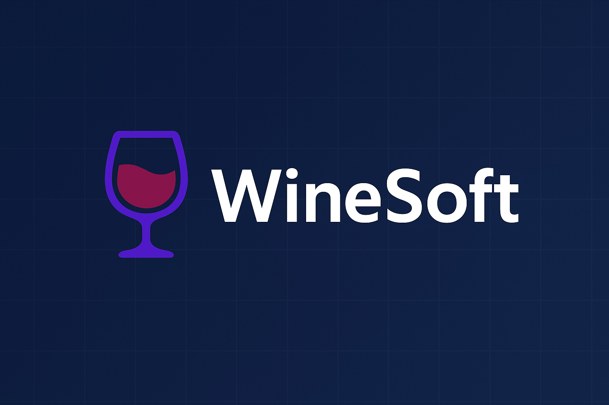

  <h1>Colores</h1>
  <p>
    Los colores son un elemento clave en la identidad de <b>WineSoft</b>, ya que transmiten tanto el <b>carácter tecnológico</b> de la solución como la <b>conexión con la tradición licorera</b>.
  </p>
  <p>
    Para el diseño del logo y la interfaz visual, se utilizó principalmente el <b>azul oscuro</b>, un color asociado a la <b>tecnología, seguridad y confianza</b>, que refuerza la fiabilidad del sistema de monitoreo inteligente.
  </p>
  <p>
    Este se complementa con el <b>morado</b>, que aporta un tono de <b>innovación y modernidad</b>, y con el <b>vino burdeos</b>, que hace referencia directa al mundo del vino y los licores, evocando <b>calidad, tradición y sofisticación</b>.
  </p>
  <p>
    La paleta se equilibra con el <b>blanco</b>, utilizado para garantizar <b>contraste, legibilidad y limpieza visual</b> en diferentes fondos.
  </p>
  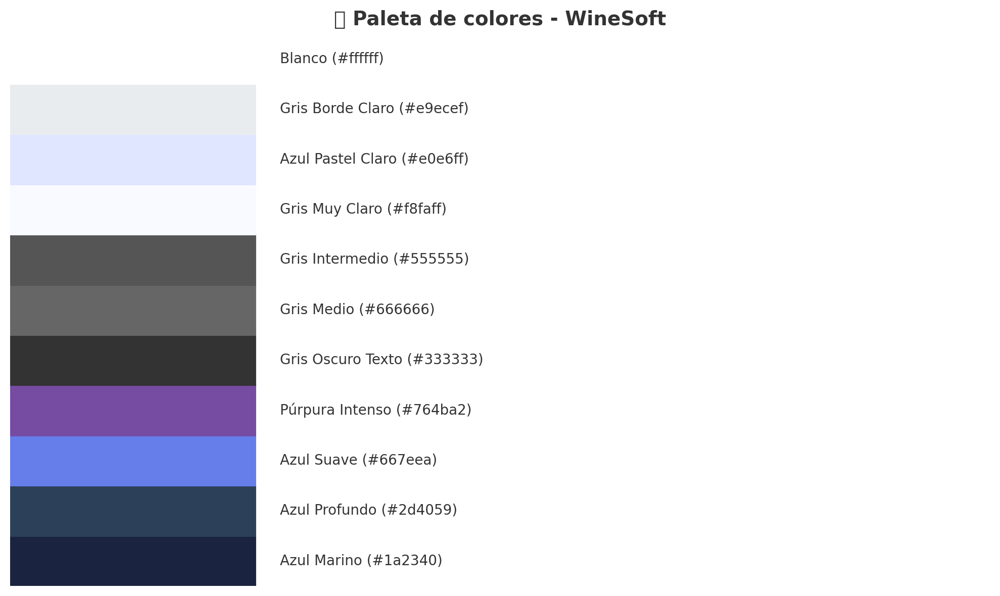
  <h1>Tipografía</h1>
  <p>
    La tipografía es un elemento esencial en la identidad visual de <b>WineSoft</b>, ya que transmite <b>modernidad, profesionalismo y claridad</b>.
  </p>
  <ul>
    <li><b>Fuente principal:</b> Inter (alternativamente Roboto o Poppins si no está disponible).</li>
    <li><b>Estilo predominante:</b> Regular para párrafos y textos explicativos.</li>
    <li><b>Estilo complementario:</b> Bold y SemiBold para títulos, subtítulos y llamadas a la acción.</li>
    <li><b>Colores aplicados:</b> Se mantiene la paleta institucional (azul oscuro, púrpura y blanco).</li>
  </ul>

  <h3>4.1.2. Web Style Guidelines.</h3>

  <h1>Imágenes</h1>
  <p>Las imágenes se utilizarán únicamente con un propósito <b>informativo o funcional</b>:</p>
  <ul>
    <li>Foto de perfil en la parte superior derecha, como acceso a la cuenta.</li>
    <li>Imágenes representativas en cada sección principal.</li>
    <li>Optimización para pantallas de alta resolución.</li>
    <li>Fondos limitados a un <b>color sólido</b> para limpieza visual.</li>
  </ul>

  <h1>Botones</h1>
  <p>Los botones estarán ubicados en:</p>
  <ul>
    <li>La barra superior.</li>
    <li>Secciones clave como inicio de sesión o mapa de calor.</li>
  </ul>
  <p>Funciones:</p>
  <ul>
    <li>Abrir ventanas.</li>
    <li>Confirmar datos.</li>
    <li>Eliminar registros.</li>
  </ul>
  <p>
    Colores:
    <ul>
      <li><b>Verde:</b> inicio de proceso.</li>
      <li><b>Rojo:</b> finalización o eliminación.</li>
    </ul>
  </p>

  <h1>Pantallas Emergentes</h1>
  <ul>
    <li>Usarán <b>colores intensos</b> para diferenciarse.</li>
    <li>Oscurecerán el fondo.</li>
    <li>Captarán la atención antes de continuar con la navegación.</li>
  </ul>

  <h1>Diseño</h1>
  <p>El sitio será <b>responsivo</b> y seguirá el patrón en “Z”:</p>
  <ol>
    <li>Logotipo (superior izquierdo).</li>
    <li>Menú de navegación (superior derecho).</li>
    <li>Acceso al perfil.</li>
    <li>Recorrido hacia contenidos y opciones inferiores.</li>
  </ol>

  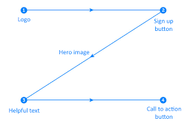


</div>

## 4.2. Information Architecture.
### 4.2.1. Organization Systems.
<div style="text-align: justify;">

  <p>
    La información se organizará siguiendo un esquema jerárquico que prioriza los datos más relevantes para la gestión de la producción de licores. Este enfoque permite que los usuarios naveguen de forma intuitiva y eficiente. En las pantallas clave, como el inicio de sesión y los paneles de control, los elementos principales (como indicadores críticos de temperatura, humedad o procesos activos) se destacarán con mayor peso visual en comparación con el resto de la información.
  </p>

  <h3>Esquemas de categorización</h3>

  <p><b>Alfabético:</b><br>
  Las listas desplegables en WineSoft estarán organizadas alfabéticamente para facilitar la búsqueda y selección. Esto aplica, por ejemplo, a características de personalización de procesos, variedades de licores o nombres de clientes y proveedores registrados en el sistema.</p>

  <p><b>Cronológico:</b><br>
  Los reportes de producción y control de calidad se presentarán en orden cronológico, lo que permitirá un seguimiento claro de las etapas en fermentación, destilación y maduración. Este esquema resulta clave para generar reportes comparativos y establecer tendencias a lo largo del tiempo.</p>

  <p><b>Por tópicos:</b><br>
  Las principales funciones de la plataforma estarán representadas con tarjetas visuales e hipervínculos para una navegación más intuitiva. Ejemplo: monitoreo en tiempo real, mantenimiento digital, control de calidad, integración con ERP y reportes analíticos.</p>

  <p><b>Según audiencia:</b><br>
  Se considera el uso diferenciado de la plataforma para distintos perfiles. Los administradores podrán acceder como pantalla principal a un panel de control global con métricas clave, mientras que los operadores tendrán acceso directo a los parámetros específicos que deben supervisar (temperatura, presión, humedad). De esta forma, cada tipo de usuario interactúa con la información más relevante para sus necesidades.</p>

  <h3>Labeling Systems</h3>

  <p>
    En WineSoft, las etiquetas cumplirán tanto un rol funcional en la experiencia del usuario como un rol técnico en la optimización SEO, garantizando una navegación clara y una visibilidad adecuada en motores de búsqueda.
  </p>

  <p><b>Nivel de Experiencia de Usuario (UX):</b><br>
  Las etiquetas estarán diseñadas para guiar al usuario de forma intuitiva en la plataforma, identificando claramente cada función: monitoreo, reportes, mantenimiento, control de calidad, entre otros.</p>

  <p><b>Nivel SEO:</b><br>
  Se aplicará un etiquetado interno que permitirá enlazar subpáginas relacionadas, como las de analítica, procesos de producción y módulos de integración. Esto mejorará la indexación en motores de búsqueda.</p>

  <p><b>Palabras Clave y Etiquetado Adecuado:</b><br>
  Cada sección del sistema (ej. “Fermentación”, “Destilación”, “Reportes Analíticos”) integrará palabras clave relevantes al rubro de producción de licores, distribuidas estratégicamente para evitar duplicidad o competencia interna.</p>

  <p><b>Impacto de las Etiquetas en Menús y Bloques Estáticos:</b><br>
  Se dará especial atención al uso de etiquetas en menús y secciones fijas de la interfaz, ya que estas son puntos clave de interacción para usuarios como administradores y operadores.</p>

  <hr>

  <h3>Tipos de Etiquetas</h3>
  <ul>
    <li><b>Etiquetas Contextuales:</b> Conectarán de manera clara las funciones internas de WineSoft, como el acceso directo a “Monitoreo en tiempo real” o “Mantenimiento programado”.</li>
    <li><b>Etiquetas de Encabezado:</b> Organizarán jerárquicamente la información en títulos y subtítulos (ejemplo: H1: Panel de Control Global, H2: Monitoreo de Temperatura), facilitando la comprensión de los contenidos.</li>
    <li><b>Etiquetas con Parámetro ALT:</b> Acompañarán todas las imágenes y gráficos (como diagramas de procesos o dashboards), garantizando accesibilidad para usuarios con lectores de pantalla o en casos de fallas de carga de imágenes.</li>
  </ul>

  <h3>4.2.3. SEO Tags and Meta Tags</h3>
  <p>
    Estas etiquetas permiten definir información codificada y metadatos que no se muestran directamente en la interfaz del usuario, pero son fundamentales para el análisis de los archivos HTML y para mejorar el posicionamiento web en buscadores.
  </p>

  <p><b>Title (Título):</b><br>
  El título de cada página será claro, descriptivo y atractivo, reflejando el propósito de la sección dentro de WineSoft. Esto ayudará a captar la atención en los motores de búsqueda y a diferenciar cada módulo.<br>
  <i>Ejemplo:</i> “WineSoft | Monitoreo Inteligente para Plantas de Producción de Licores”</p>

  <p><b>Etiqueta Título:</b><br>
  <code>&lt;title&gt;WineSoft | Smart Monitoring for Liquor Production&lt;/title&gt;</code></p>

  <p><b>Descripción (Meta Description):</b><br>
  Se utilizarán descripciones breves y precisas que resuman el contenido de la página, incentivando a los usuarios a visitar la plataforma.<br>
  <i>Ejemplo:</i> “WineSoft permite a destilerías y plantas de producción de licores optimizar sus procesos con monitoreo en tiempo real, trazabilidad y control de calidad.”</p>

  <p><b>Etiqueta Descripción:</b><br>
  <code>&lt;meta name="description" content="WineSoft permite a destilerías y plantas de producción de licores optimizar sus procesos con monitoreo en tiempo real, trazabilidad y control de calidad."&gt;</code></p>

  <p><b>Codificación de Caracteres:</b><br>
  Para asegurar la correcta visualización de caracteres especiales en español e inglés (acentos, eñes, símbolos), se utilizará la siguiente etiqueta de codificación:</p>

  <p><b>Etiqueta Codificación:</b><br>
  <code>&lt;meta charset="UTF-8"&gt;</code></p>

</div>
<div style="text-align: justify;">

  <h3>4.2.4 Searching Systems</h3>
  <p>
    Se planifica incluir un sistema de búsqueda en la aplicación principal que permita:
  </p>
  <ul>
    <li>Buscar insumos por nombre o categoría (ejemplo: levaduras, granos, barricas, botellas).</li>
    <li>Filtrar por fecha de caducidad, lote o stock disponible en inventario.</li>
    <li>Sugerencias automáticas mediante función de autocompletado que reduzca el tiempo de búsqueda.</li>
    <li>Integración con etiquetas rápidas para búsquedas inmediatas, como “fermentación”, “destilación” o “mantenimiento pendiente”.</li>
  </ul>
  <p>
    Este buscador permitirá a los usuarios (administradores y operadores) localizar información crítica en segundos, reduciendo errores de gestión y mejorando la eficiencia operativa en la planta de producción.
  </p>

  <hr>

  <h3>4.2.5 Navigation Systems</h3>
  <p>
    El sistema de navegación de la landing page de <b>WineSoft</b> se compone de:
  </p>

  <p><b>Menú principal (Header):</b><br>
  Ubicado en la parte superior, contiene enlaces ancla hacia las secciones <i>Features</i>, <i>About</i> y <i>Contact</i>. Incluye además un botón para cambiar de idioma (<i>language-switcher</i>) que alterna entre inglés y español, facilitando su uso en mercados internacionales.</p>

  <p><b>Menú móvil (Hamburger menu):</b><br>
  Para dispositivos con pantallas pequeñas, se implementa un botón tipo hamburguesa que despliega los enlaces en columna (<code>.nav-links.active</code>), manteniendo accesibilidad y simplicidad en la navegación.</p>

  <p><b>Footer:</b><br>
  Contiene enlaces secundarios organizados en tres columnas:</p>
  <ul>
    <li><b>Product:</b> Acceso a módulos clave como Monitoreo, Inventario, Reportes y Automatización.</li>
    <li><b>Support:</b> Incluye Soporte Técnico, Preguntas Frecuentes y Contacto.</li>
    <li><b>Company:</b> Presenta información institucional, misión, visión y descripción de la marca WineSoft.</li>
  </ul>

  <p><b>Interactividad:</b><br>
  El archivo <code>main.js</code> implementa mejoras en la experiencia de navegación:</p>
  <ul>
    <li>Scroll suave al hacer clic en los enlaces para una transición más fluida.</li>
    <li>El header cambia de estilo visual al desplazarse la página (<code>window.scroll</code> event), reforzando la visibilidad de la navegación.</li>
    <li>Resaltado dinámico de la sección activa para guiar al usuario dentro del sitio.</li>
  </ul>

</div>

## 4.3. Landing Page UI Design.

### 4.3.1. Landing Page Wireframe.

<div align="justify">
  La <b>landing page de WineSoft</b>, diseñada para ser intuitiva y accesible, inicia con una sección de bienvenida que resalta las principales funciones y beneficios del sistema de monitoreo inteligente para plantas de producción de licores; continúa con <b>“Nosotros”</b>, donde se presenta la misión y visión, destacando el compromiso con la innovación, calidad y trazabilidad en la industria licorera; en <b>“Plataforma”</b> se muestra una vista previa de las funcionalidades principales como el monitoreo en tiempo real y los reportes automáticos; la sección <b>“Servicios”</b> explica módulos clave como control de inventario, alertas preventivas, mantenimiento y cumplimiento normativo; en <b>“Planes”</b> se detallan las opciones de suscripción según las necesidades de cada destilería, desde el plan básico hasta la versión premium con integración ERP; y finalmente, en <b>“Contacto”</b> se ofrece un formulario para comunicación directa con el equipo de WineSoft, garantizando soporte técnico personalizado.
</div>

#### Lading Page Wireframe - Inicio

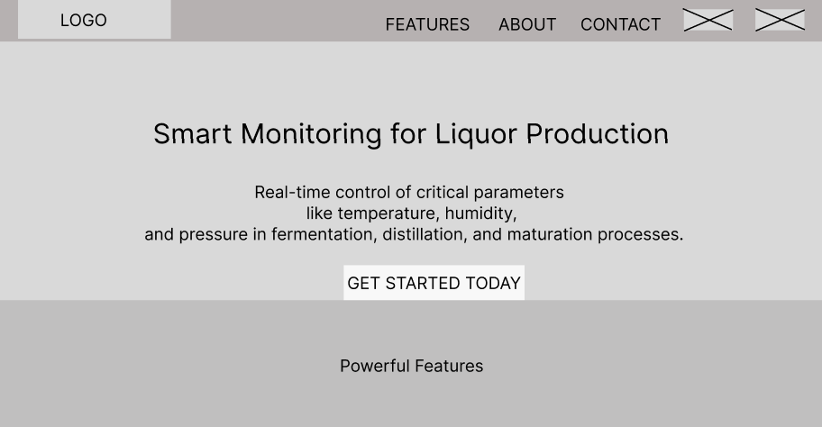

#### Lading Page Wireframe - Product

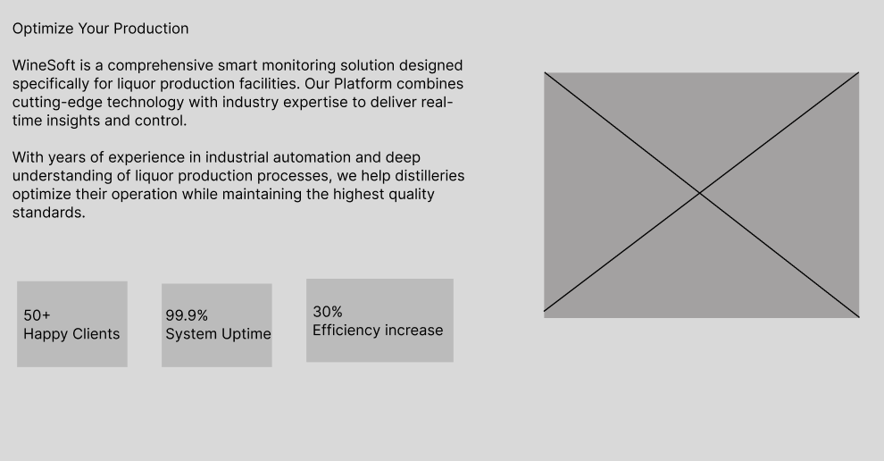

#### Lading Page Wireframe - Servicios

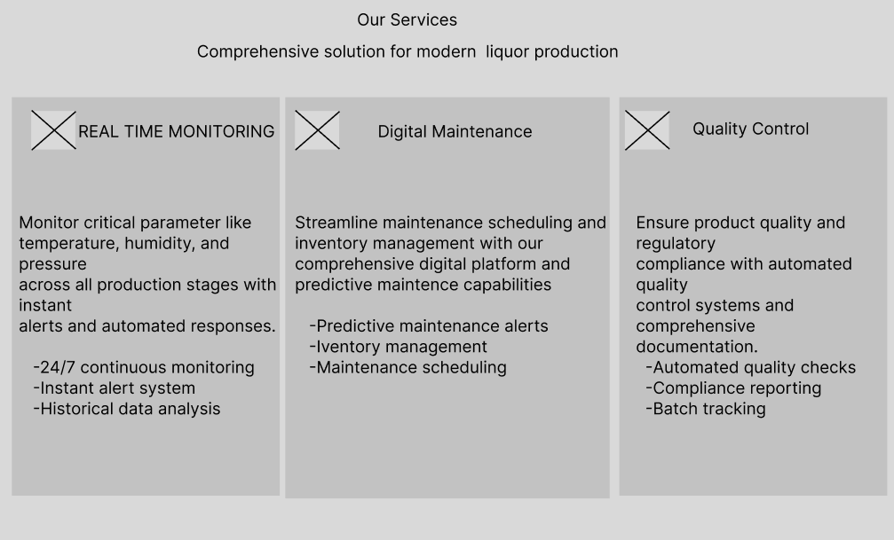

#### Lading Page Wireframe - Planes

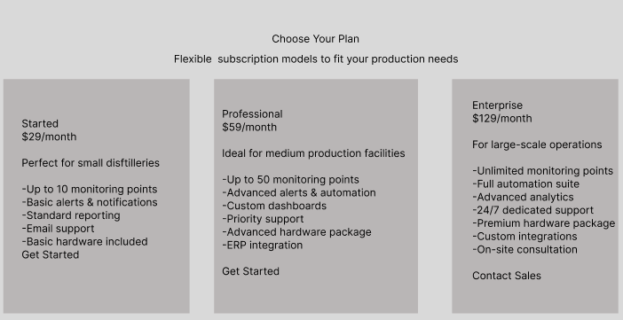

#### Lading Page Wireframe - Contáctanos

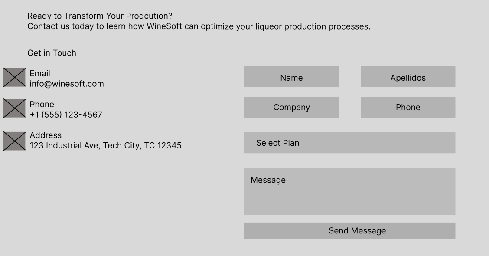

### 4.3.2. Landing Page Mock-up.

<div align="justify">
  El <b>wireframe de la landing page</b> para la vista de escritorio ha sido esencial para estructurar de manera clara los elementos clave del sistema de monitoreo inteligente de plantas de producción de licores. Siguiendo este diseño inicial, se desarrolló el <b>mock-up de la landing page</b>, manteniendo coherencia con la propuesta de valor y los módulos previamente descritos, como el <b>monitoreo en tiempo real</b>, las <b>alertas automáticas</b> y la <b>trazabilidad del inventario</b>. En la imagen siguiente, se aprecia la implementación de la paleta de colores primarios y secundarios seleccionada, junto con la tipografía definida, reflejando una identidad visual moderna y profesional. Esto demuestra la atención al detalle y la consistencia del estilo visual a lo largo del diseño, reforzando la percepción de <b>innovación, confiabilidad y tecnología</b> aplicada al sector licorero.
</div>

#### Lading Page Mock-up - Inicio

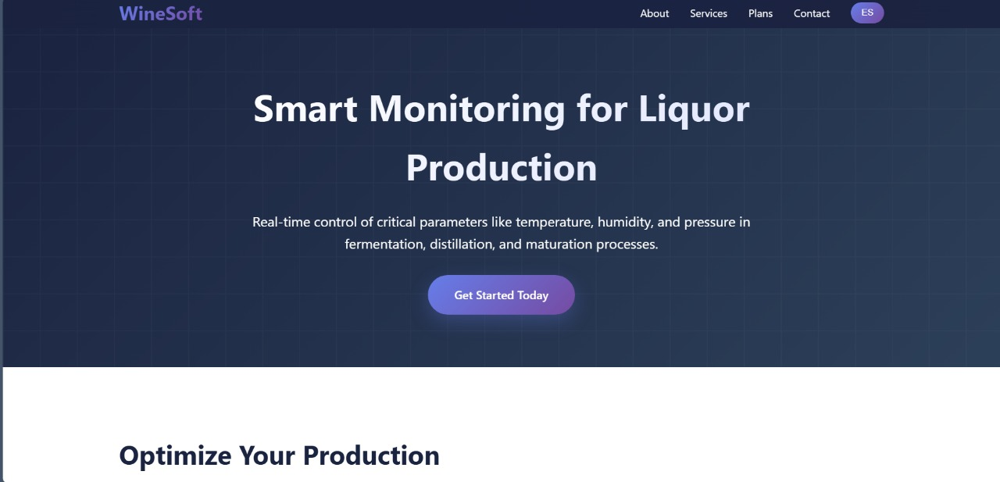

#### Lading Page Mock-up - Product

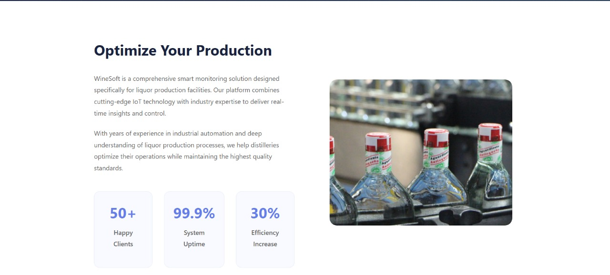

#### Lading Page Mock-up - Servicios

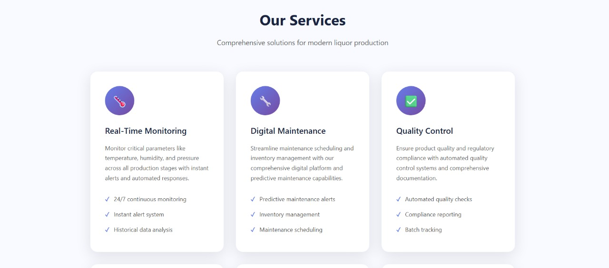

#### Lading Page Mock-up - Planes

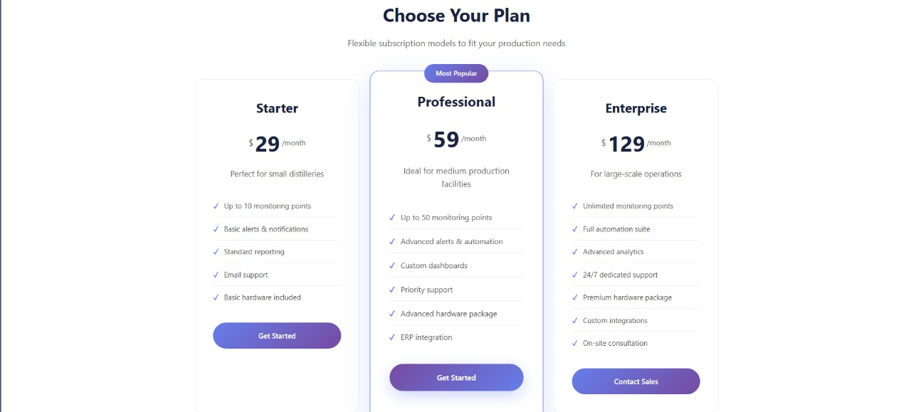

#### Lading Page Mock-up - Contáctanos

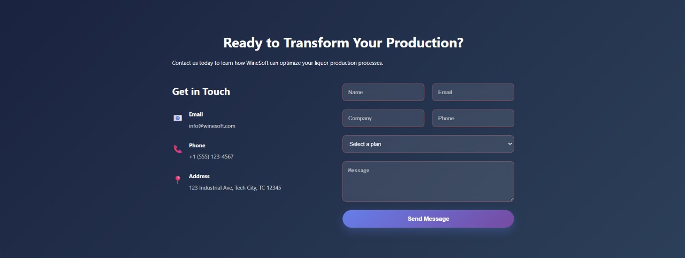

# Capítulo V: Product Implementation, Validation & Deployment

## 5.1. Software Configuration Management.

### 5.1.1.	Software Development Environment Configuration.

En esta sección se especifican los productos de software que el equipo debe utilizar para garantizar la correcta colaboración y el desarrollo del proyecto WineSoft, indicando su propósito de uso, así como las rutas de referencia o descarga correspondientes.

### Project Management

**Producto: Trello**

Propósito: Organización de tareas, planificación de sprints y seguimiento del progreso del proyecto mediante tableros Kanban.

**Ruta de referencia: https://trello.com**

**Producto: GitHub Projects**

Propósito: Seguimiento del flujo de trabajo en el mismo entorno de control de versiones, vinculando issues, pull requests y milestones.

**Ruta de referencia: https://github.com**

### Requirements Management

**Producto: Google Drive (Documentos de Google)**

Propósito: Redacción, gestión colaborativa y versionamiento de especificaciones de requerimientos.

**Ruta de referencia: https://drive.google.com**

### Product UX/UI Design

**Producto: Figma**

Propósito: Diseño de interfaces de usuario y prototipos interactivos para la landing page.

**Ruta de referencia: https://figma.com**

### Software Development

**Producto: Visual Studio Code**

Propósito: Editor de código principal para la implementación de la landing page (HTML, CSS, JavaScript).

**Ruta de descarga: https://code.visualstudio.com**

**Producto: Git**

Propósito: Control de versiones y gestión de ramas del repositorio.

**Ruta de descarga: https://git-scm.com/downloads**

### Software Deployment

**Producto: GitHub Pages**

Propósito: Hospedaje gratuito de la landing page de WineSoft, con integración continua desde el repositorio principal.

**Ruta de referencia: https://pages.github.com**

### Software Documentation

**Producto: Markdown (README en GitHub)**

Propósito: Documentación técnica del proyecto, instalación y despliegue.

**Ruta de referencia: https://github.com**

### 5.1.2.	Source Code Management.

La gestión de todas las actividades que tendrá la startup de Capa6, se llevaran a cabo en dentro de una organización del aplicativo web Github.

- Organization: https://github.com/1asi0730-2520-7469-Capa6

- Landing Page Repository: https://github.com/1asi0730-2520-7469-Capa6/WineSoft-LandingPage

Asimismo, para llevar un mejor control de los avances que cada uno de los miembros del equipo vaya a entregar, se utilizará la convención de Gitflow donde procederemos a tener buenas prácticas para crear ramas y realizas cambios manteniendo el código consistente y alcanzar una buena comunicación del avance de los proyectos.

Con esto mencionado, definiremos nuestras 2 ramas principales, de las cuales vendrían a ser main y develop.

- **main:** es la rama donde definiremos las versiones oficiales de nuestro repositorio que ya deben pasar a producción.

- **develop:** es la rama que se utilizará como rama de integración para cada uno de los "features" branches. Una vez que el head alcance un estado estable y el equipo considere que ya está listo para ser lanzado, se unificará con la rama release.

**Ramas complementarias:**

- **feature:** aquí trabajaremos cada uno de los features que se unirán a la rama develop. Estas mismas segmentarán cada una de las características que piden los usuarios tanto en la landing page como web application.

- **release:** esta rama se utilizará para preparar el lanzamiento de una nueva versión en la rama main. Allí mismo, se corregirán pequeños bugs; liberando así en la rama develop estas preparaciones evitando así el retraso en el desarrollo mientras se prepara un nuevo lanzamiento.

- **hotfix:** se utilizará cuando la última versión de la rama main necesite actualizarse debido a bugs críticos que no puede esperar a un siguiente lanzamiento para resolverse.

**Commit Conventions:**

El formato de nuestros commits sigue la estructura de los "Conventional Commits" en su versión 1.0.0 (https://www.conventionalcommits.org/en/v1.0.0/) con el objetivo de proporcionar una lectura simple de los mismos que vayamos indicando. Este seguirá el siguiente formato:

```
<type>[optional scope]: <description>
```
Donde:

- type: especifica el tipo de cambio realizado (si es docs, feat, fix, entre otros).

- scope: define el alcance que tiene nuestro commit.

- description: se define una breve descripción de los cambios que sufrió o se implementaron en el código.

**Release Versioning Conventions:**

Para el formato de versiones se aplicará "Semantic Versioning 2.0.0", donde cada unas de las versiones siguen el formato (X, Y, Z).

A continuación, se desarrollarán cada uno de estos formatos:

- X: representa una versión mayor. Aquí se ubican todos los cambios relacionados que no son compatibles con las versiones anteriores. Empezando desde 0 para el desarrollo inicial y 1 cuando esté disponible al público para ser usado. Por convención Y y Z, estas se reinician a 0 cuando incrementan.

- Y: representa una versión menor. Aquí se encuentran los cambios que sí son compatibles con versiones anteriores. Adicional a ello, se incluirán los commits desde la rama release cada vez que se integren nuevas funcionalidades. Por convención, Z se reiniciará a 0 cuando este incremente.

- Z: representa los parches y correcciones menores. Aquí se incluyen los commits realizados desde la rama hotfix que se acaban haciendo merge a la rama main.

### 5.1.3.	Source Code Style Guide & Conventions.

Para lo que respecta el desarrollo de la parte de HTML y CSS se utilizará Google HTML/CSS Style Guide, ya que estos contienen convenciones que se deben tomar en cuenta al momento de trabajar con dichas tecnologías. Para informarnos acerca de las buenas prácticas de uso, accederemos mediante el siguiente el enlace: https://google.github.io/styleguide/htmlcssguide.html. Entre algunas de estas convenciones mencionaremos las siguientes:

Siempre declarar el tipo de documento <!DOCTYPE html> al inicio del documento HTML.

Usar siempre letras en minúsculas para los nombres de los elementos (como &lt;h1&gt;, &lt;p&gt;, &lt;footer&gt;, etc).

- Cerrar siempre con los elementos de HTML (por ejemplo: &lt;h1&gt;&lt;/h1&gt;).
- Siempre colocar entre comillas los atributos dentro de un elemento HTML (&lt;h1 class="name"&gt;&lt;/h1&gt;).
- Declarar los atributos alt, width and height para imágenes.
- Estandarizar tanto el espaciado y signo de manera igualitaria.
- Evitar líneas de código extensas.
- No olvidar declarar el &lt;title&gt;&lt;title&gt; en apartado del &lt;head&gt;&lt;/head&gt; (ubicado al inicio del documento HTML).

Utilizar meta tags al inicio del documento.

Para el caso del lenguaje JavaScript, se usará la guía de estilos brindada por nuestros amigos de Google mediante el siguiente repositorio de Github: https://google.github.io/styleguide/jsguide.html#file-name. Aquí se presentarán las siguientes convenciones:

- Nombrar las variables y funciones con camelcase.
- Usar espaciados después de una coma o dos puntos.
- Utilizar comillas simples para los tipos de datos String.
- Usar el punto y coma al final de cada sentencia.
- Evitar declarar variables var; en su lugar, utilizar let o const para mitigar errores en variables y valores la momento de acceder a ellos.

Para el lenguaje Gherkin se usará las conveciones Make Your Gherkin Specifications More Readable con el objetivo de utilizar buenas prácticas que nos permitan entender con exactitud lo desarrollado. Los archivos creados tendrán la extensión .feature. Para conocer más acerca de la forma de escribir en el lenguaje Gherkin, utilizaremos el siguiente enlace: https://specflow.org/gherkin/gherkin-conventions-for-readable-specifications/. A continuación, se presentarán las siguientes convenciones:

- Escribir especificaciones en lenguaje simple y fácil de comprender para todos los miembros del equipo.
- Utilizar las palabras reservadas "Given, When, When y And" para redactar los pasos del Scenario.
- Usar verbos finitos para las acciones del Scenario.
- Evitar redundancias en el detalle de los pasos en el Scenario.
- Usar un formato consistente en la especificación para todos los Scenarios.

Para el desarrollo, utilizaremos Vue JS del cual tiene tomaremos como referencia las convenciones definidas por el equipo de desarrollo de Vue. El objetivo principal que este tiene, el generar el mantenimiento del sistema. Del mismo modo, se puede visualizar dichas convenciones en el siguiente enlace: https://vuejs.org. A continuación, presentaremos aglunas convenciones esenciales de Vue JS:

- Los nombres de los componentes siempre deben tener palabras (Vue.component('todo-item', {...})), excepto en los componentes raíz y los componentes integrados de Vue, como &lt;transition&gt; o &lt;component&gt;.
- El componente data siempre es una función y retorna valores.
- Definir los detalles de las propiedades como el status con sus subdetalles.
- Usar siempre ".key" con "v-for".
- Evitar juntar "v-if" con "v-for" en un mismo scope.

Para el uso de C#, Microsoft provee una guía de estilos bastante completa la cual nos permitirá aplicar estándares que sus propios desarrolladores implementan. Se puede conocer más sobre esto en el siguiente link: https://learn.microsoft.com/en-us/dotnet/csharp/fundamentals/coding-style/coding-conventions.

Entre algunas convenciones podemos mencionar:
- Al declarar una clase, estructura o record, hay que nombrarlo mediante el estilo de nombre Pascal Case.
- Al declarar parámetros, hay que nombrarlos con Camel Case y utilzar el prefijo con el guión abajo "_".
- Realizar comentarios en una nueva línea de código, no al final de una linea. Además, evitar el uso excesivo de comentarios.
- Respetar el espaciado después de una coma y operadores.
- Las llaves deben ir en una nueva línea nueva al declarar una nueva clase, estructura, etc.

Finalmente, para lo que respecta .NET Framework, también perteneciente a Microsoft, este provee una guía de estilos bastante completa de las cúales abarcan varias nociones involucradas en el uso de este framework. Se puede acceder a la guía desde el siguiente enlace: https://github.com/dotnet/aspnetcore/wiki/Engineering-guidelines#coding-guidelines.

A continuación, se mencionará algunas convenciones:

- Todos los archivos source deben tener los comentarios de las licencias de .NET:
```
// Copyright (c) .NET Foundation. All Rights reserved.
// Licensed under the Apache License, Version 2.0. See License.txt in the project root for license information.
```
- Evitar ".this" a menos que sea un caso excepcional.
- Siempre especificar la visibilidad de los miembros (private, public).
- Las llaves van en una nueva línea separada dek código.
- Emplear espaciado después de comas y operadores.

### 5.1.4.	Software Deployment Configuration.


## 5.2.	Landing Page, Services & Applications Implementation.

### 5.2.1.	Sprint 1

#### 5.2.1.1.	Sprint Planning 1.

| Sprint # | Sprint 1 |
|----------|-----------|
| **Sprint Planning Background** | |
| Date | 2025-04-07 |
| Time | 11:36 AM |
| Location | Discord |
| Prepared By | Gonzalo Alonso Carhuancote Dominguez |
| Attendees (to planning meeting) | Angelo Stephano Moscoso Bejar, Yazid Said Conde, Joan Fernando Teves Samaniego, Antonio Rodrigo Duran Díaz, Gonzalo Alonso Carhuancote Dominguez |

| Sprint 0 Review Summary | Al ser el primer sprint del proyecto, no se cuenta con un sprint previo que permita realizar un review summary. |
|-----------------------------|--------------------------------------------------------------------------------------------------------------------------------|
| Sprint 0 Retrospective Summary | Al ser el primer sprint, no se cuenta con retrospectiva previa. Se definió como meta inicial el desarrollo e implementación de la Landing Page de Winesoft. |

| **Sprint Goal & User Stories** | |
|--------------------------------|--|
| Sprint 1 Goal | Desarrollar e implementar la Landing Page de Winesoft utilizando HTML5, CSS3 y JavaScript, siguiendo el diseño en Figma y desplegándola en GitHub Pages. |
| Sprint 1 Velocity | 17 |
| Sum of Story Points | 17 |


#### 5.2.1.2.   Aspect Leaders and Collaborators.

| Team Member (Last Name, First Name) | GitHub Username | Landing Page (L/C) | Responsive Design (L/C) | Comparador de Planes (L/C) | Switcher de Idiomas (L/C) | Footer (L/C) |
|-------------------------------------|-----------------|---------------------|--------------------------|-----------------------------|----------------------------|---------------|
| Moscoso Bejar, Angelo Stephano      | StephanoDang    | C                   | L                        | C                           | C                          | L             |
| Conde, Yazid Said                   | BL4Z3K4D        | C                   | C                        | L                           | C                          | C             |
| Teves Samaniego, Joan Fernando      | Joan3210        | C                   | C                        | C                           | L                          | C             |
| Durán Díaz, Antonio Rodrigo         | Sltcrd          | C                   | C                        | C                           | C                          | C             |
| Carhuancote Dominguez, Gonzalo Alonso | Gonzalo251104   | L                   | C                        | C                           | C                          | C             |


#### 5.2.1.3.	Sprint Backlog 1.

| Sprint # | Sprint 1 |
|----------|-----------|
| **User Story** | | **Work-item/Task** | | | | | |
| ID | Title | ID | Title | Description | Estimation (Hours) | Assigned To | Status (To-do/In-Process/To-Review/Done) |
|----|-------|----|-------|-------------|---------------------|-------------|------------------------------------------|
| US-01 | Landing Page informativa | UT-01 | Hero Section | Implementar el slogan y el botón de redireccionamiento de la aplicación, junto con la imagen representativa de Winesoft | 2 | Gonzalo Alonso Carhuancote Dominguez | Done |
|      |                           | UT-02 | About Section | Agregar la descripción detallada de la aplicación Winesoft | 1 | Gonzalo Alonso Carhuancote Dominguez | Done |
| US-02 | Responsive Design | UT-03 | Responsive Web Design | Añadir los media queries necesarios para que la Landing Page sea adaptable a diferentes dispositivos | 2 | Angelo Stephano Moscoso Bejar | Done |
| US-03 | Comparador de Planes | UT-04 | Choose Plan Section | Implementar las cards que definan los diferentes planes que ofrece Winesoft con sus beneficios | 2 | Yazid Said Conde | Done |
| US-04 | Switcher de Idiomas | UT-05 | Botón de cambio de idiomas | Implementar el botón para realizar el cambio de idioma entre español e inglés | 2 | Joan Fernando Teves Samaniego | Done |
| US-05 | Tema de Colores | UT-06 | Selección de colores | Aplicar colores representativos de Winesoft al Landing Page | 1 | Antonio Rodrigo Duran Díaz | Done |
|      |                           | UT-07 | Footer Colors | Aplicar los colores seleccionados al Footer Section | 1 | Angelo Stephano Moscoso Bejar | Done |
| US-06 | Vista de Developers | UT-08 | Development Section | Agregar los diferentes roles que cada miembro del equipo Winesoft cumplió dentro de la aplicación | 2 | Joan Fernando Teves Samaniego | Done |
|      |                           | UT-09 | Developers Images Section | Colocar las imágenes de cada miembro del equipo | 1 | Antonio Rodrigo Duran Díaz | Done |
| US-07 | Footer informativo | UT-10 | Footer Section | Implementar Footer Section con links correspondientes | 2 | Yazid Said Conde | Done |
|      |                           | UT-11 | Responsive Footer | Agregar diseño responsive al Footer Section | 2 | Angelo Stephano Moscoso Bejar | Done |


#### 5.2.1.4.	Development Evidence for Sprint Review.

| Repository | Branch | Commit Id | Commit Message | Commit Message Body | Commited on (Date) |
|------------|--------|-----------|----------------|----------------------|--------------------|
| winesoft/landing-page | feature/hero-section | a1b2c3d | feat: add hero section with slogan and CTA | Se implementó la sección principal del landing con el eslogan y el botón de redirección a la aplicación. | 2025-04-08 |
| winesoft/landing-page | feature/about-section | d4e5f6g | feat: add about section | Se agregó la descripción detallada de Winesoft en la sección "About". | 2025-04-09 |
| winesoft/landing-page | feature/responsive-design | h7i8j9k | feat: responsive design improvements | Se añadieron media queries para asegurar la adaptación del landing page en diferentes dispositivos. | 2025-04-10 |
| winesoft/landing-page | feature/choose-plan | l1m2n3o | feat: implement plan comparison section | Se implementaron las cards de comparación de planes con sus beneficios. | 2025-04-11 |
| winesoft/landing-page | feature/language-switcher | p4q5r6s | feat: add language switcher (ES/EN) | Se agregó el botón para cambiar el idioma entre español e inglés. | 2025-04-11 |
| winesoft/landing-page | feature/footer | t7u8v9w | feat: footer section with links | Se implementó el footer con links informativos y diseño responsive. | 2025-04-12 |


#### 5.2.1.5.	Execution Evidence for Sprint Review.

#### 5.2.1.6.	Services Documentation Evidence for Sprint Review.

#### 5.2.1.7.	Software Deployment Evidence for Sprint Review.

#### 5.2.1.8.	Team Collaboration Insights during Sprint.


# Conclusiones

# Bibliografía

- 

- Sociedad Nacional de Industrias (SNI). (2021). *Industria de bebidas alcohólicas: estructura empresarial y perspectivas*. Instituto de Estudios Económicos y Sociales. Recuperado de https://sni.org.pe/wp-content/uploads/2022/01/42-Bebidas-Alcoholicas.pdf


# Anexos
